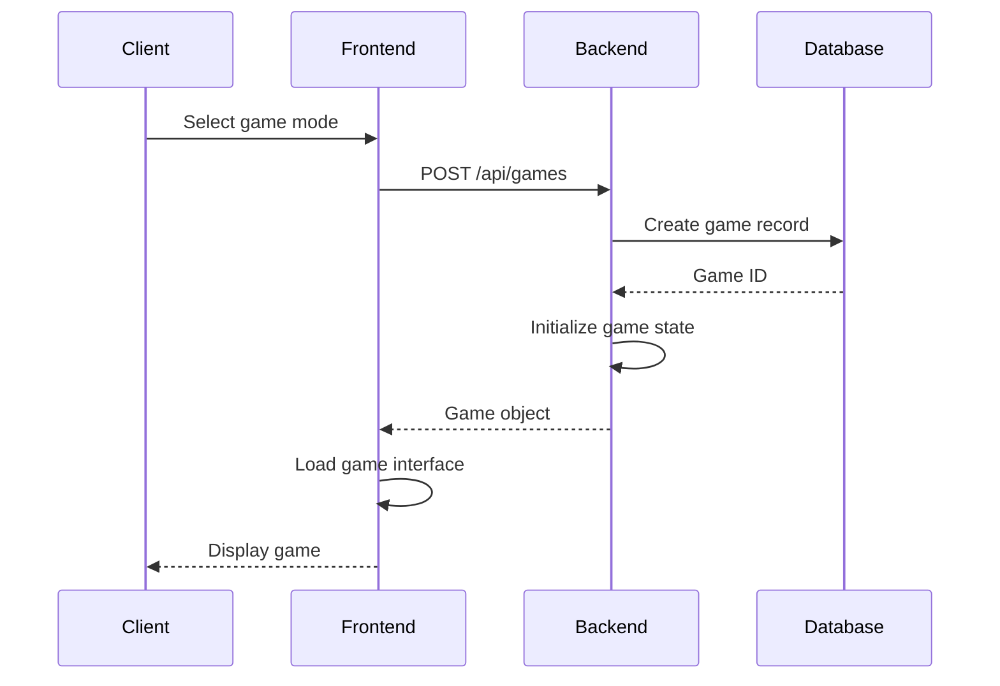
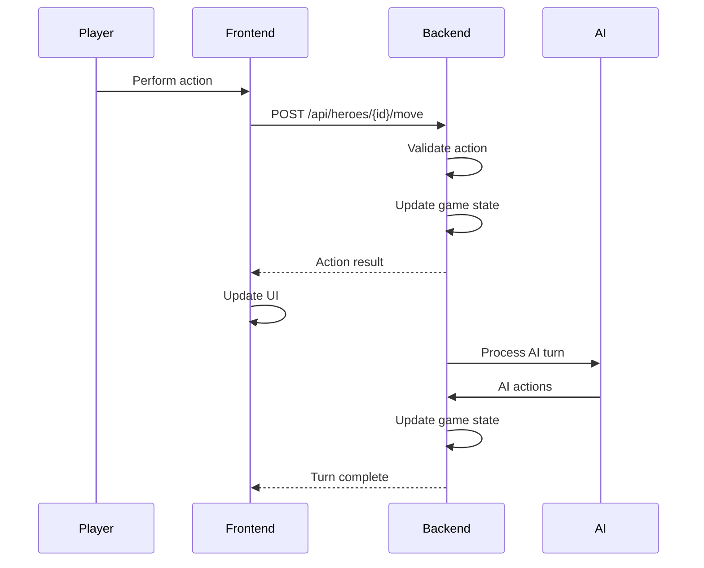
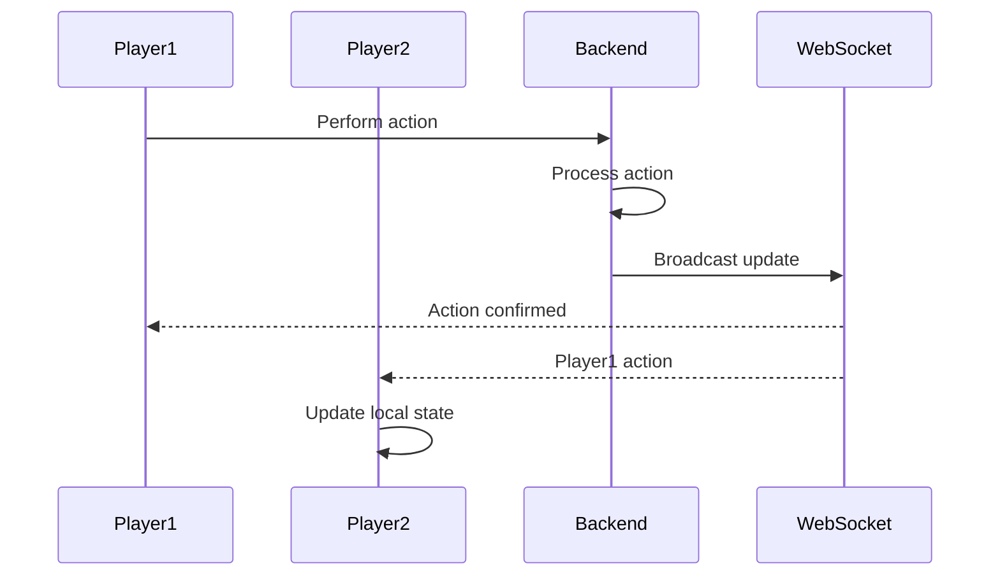

# 🏗️ Heroes of Time - System Architecture

## 📋 Overview

**Heroes of Time** is built with a modern **microservices-inspired architecture** using **React + Spring Boot**, designed for scalability, real-time multiplayer, and maintainability.

### 🎯 Architecture Principles
- **Separation of Concerns** - Clear layer boundaries
- **Real-time Communication** - WebSocket integration
- **Stateless Backend** - RESTful API design
- **Reactive Frontend** - Event-driven UI updates
- **Testable Code** - Comprehensive testing strategy

---

## 🧠 System Intelligence Distribution

### 🖥️ Backend (Spring Boot) - Core Game Logic

#### 📍 Primary Components
```
backend/src/main/java/com/example/demo/
├── service/GameService.java           # Main game engine
├── service/BuildingService.java       # Castle management
├── service/AIService.java             # AI opponents
├── service/MultiplayerService.java    # Session management
└── service/ScenarioService.java       # Game scenarios
```

#### 🎯 Backend Responsibilities
- **🎮 Game State Management** - Authoritative game state
- **⚔️ Combat Resolution** - Battle calculations and outcomes
- **🏰 Building System** - Construction and upgrade logic
- **🤖 AI Decision Making** - Computer player intelligence
- **🌐 Multiplayer Coordination** - Session and player management
- **💾 Data Persistence** - Database operations and caching
- **🔐 Validation** - Input validation and security
- **📊 Analytics** - Performance metrics and logging

### 🎨 Frontend (React) - User Interface & Experience

#### 📍 Primary Components
```
frontend/src/
├── components/EnhancedScenarioSelector.tsx  # Game mode selection
├── components/TrueHeroesInterface.tsx        # Main game interface
├── components/CastleManagement.tsx           # Building management
├── components/MagicInventory.tsx             # Item system
├── store/useGameStore.ts                     # State management
└── services/api.ts                           # Backend communication
```

#### 🎯 Frontend Responsibilities
- **🎨 User Interface** - Interactive game presentation
- **📱 Responsive Design** - Multi-device compatibility
- **🔄 State Management** - Local state synchronization
- **🌐 API Communication** - Backend service integration
- **🎭 Animation System** - Visual effects and transitions
- **🌍 Internationalization** - Multi-language support
- **📊 Performance Optimization** - Efficient rendering

---

## 🔌 Communication Architecture

### REST API Endpoints

#### Game Management
| Endpoint | Method | Purpose | Response |
|----------|--------|---------|----------|
| `/api/games/{id}` | GET | Get game state | Game object |
| `/api/games` | POST | Create new game | Game ID |
| `/api/games/{id}/join` | POST | Join game | Updated game |
| `/api/games/{id}/end-turn` | POST | End current turn | Turn result |

#### Hero Actions
| Endpoint | Method | Purpose | Response |
|----------|--------|---------|----------|
| `/api/heroes/{id}/move` | POST | Move hero | Action result |
| `/api/heroes/{id}/attack` | POST | Attack target | Combat result |
| `/api/heroes/{id}/collect` | POST | Collect resource | Resource update |

#### Castle System
| Endpoint | Method | Purpose | Response |
|----------|--------|---------|----------|
| `/api/games/{id}/buildings` | GET | List buildings | Building array |
| `/api/games/{id}/buildings/construct` | POST | Build structure | Construction result |
| `/api/games/{id}/buildings/{id}/upgrade` | POST | Upgrade building | Upgrade result |

### WebSocket Communication

#### Connection Flow
```javascript
// 1. Client connects to WebSocket
const socket = new SockJS('/ws');
const stompClient = Stomp.over(socket);

// 2. Subscribe to game updates
stompClient.subscribe('/topic/game/' + gameId, (message) => {
    const update = JSON.parse(message.body);
    handleGameUpdate(update);
});

// 3. Send game actions
stompClient.send('/app/game.action', {}, JSON.stringify({
    type: 'MOVE_HERO',
    heroId: 'hero-123',
    position: { x: 5, y: 3 }
}));
```

#### Message Types
- **GAME_UPDATE** - Game state changes
- **PLAYER_ACTION** - Player action notifications
- **TURN_CHANGE** - Turn progression updates
- **COMBAT_RESULT** - Battle outcome notifications

---

## 💾 Data Architecture

### Database Schema (H2/PostgreSQL)

#### Core Entities
```sql
-- Game Sessions
CREATE TABLE game_sessions (
    id BIGINT PRIMARY KEY,
    session_id VARCHAR(255) UNIQUE NOT NULL,
    name VARCHAR(255) NOT NULL,
    status VARCHAR(50) NOT NULL,
    max_players INTEGER NOT NULL,
    current_players INTEGER DEFAULT 0,
    created_at TIMESTAMP DEFAULT CURRENT_TIMESTAMP
);

-- Buildings
CREATE TABLE buildings (
    id VARCHAR(255) PRIMARY KEY,
    castle_id VARCHAR(255) NOT NULL,
    player_id VARCHAR(255) NOT NULL,
    game_id VARCHAR(255) NOT NULL,
    building_type VARCHAR(100) NOT NULL,
    level INTEGER DEFAULT 1,
    position_x INTEGER,
    position_y INTEGER,
    construction_time INTEGER DEFAULT 0,
    is_constructed BOOLEAN DEFAULT FALSE
);

-- AI Players
CREATE TABLE ai_players (
    id VARCHAR(255) PRIMARY KEY,
    name VARCHAR(255) NOT NULL,
    difficulty VARCHAR(50) NOT NULL,
    personality VARCHAR(50) NOT NULL,
    game_id VARCHAR(255) NOT NULL,
    created_at TIMESTAMP DEFAULT CURRENT_TIMESTAMP
);

-- Scenarios
CREATE TABLE scenarios (
    id BIGINT PRIMARY KEY,
    scenario_id VARCHAR(255) UNIQUE NOT NULL,
    name VARCHAR(255) NOT NULL,
    description TEXT,
    difficulty VARCHAR(50) NOT NULL,
    max_players INTEGER NOT NULL,
    victory_condition VARCHAR(100) NOT NULL,
    is_active BOOLEAN DEFAULT TRUE
);
```

### State Management (Frontend)

#### Zustand Store Structure
```typescript
interface GameStore {
    // Core game state
    currentGame: Game | null;
    gameMap: HexTile[][];
    selectedHero: Hero | null;
    currentPlayer: Player | null;
    
    // UI state
    isLoading: boolean;
    error: string | null;
    selectedTile: HexTile | null;
    
    // Game actions
    loadGame: (gameId: string) => Promise<void>;
    moveHero: (heroId: string, position: Position) => Promise<void>;
    attackTarget: (heroId: string, targetId: string) => Promise<void>;
    endTurn: () => Promise<void>;
    
    // Magic system
    playerInventory: MagicObject[];
    equippedItems: Record<string, MagicObject>;
    equipItem: (item: MagicObject) => void;
    unequipItem: (slotId: string) => void;
    
    // Multiplayer
    multiplayerSession: MultiplayerSession | null;
    joinSession: (sessionId: string) => Promise<void>;
    leaveSession: () => Promise<void>;
}
```

---

## 🔄 System Flow

### Game Initialization


### Turn Processing


### Multiplayer Synchronization


---

## 🏗️ Component Architecture

### Backend Layer Structure

#### Controller Layer
```java
@RestController
@RequestMapping("/api")
public class GameController {
    
    @Autowired
    private GameService gameService;
    
    @GetMapping("/games/{gameId}")
    public ResponseEntity<Game> getGame(@PathVariable String gameId) {
        // Handle HTTP request
    }
}
```

#### Service Layer
```java
@Service
@Transactional
public class GameService {
    
    @Autowired
    private GameRepository gameRepository;
    
    public Game createGame(GameConfig config) {
        // Business logic
    }
}
```

#### Repository Layer
```java
@Repository
public interface GameRepository extends JpaRepository<Game, String> {
    
    @Query("SELECT g FROM Game g WHERE g.status = :status")
    List<Game> findByStatus(@Param("status") GameStatus status);
}
```

### Frontend Component Structure

#### Container Components
```typescript
// Game page container
const Game: React.FC = () => {
    const { gameId } = useParams();
    const { currentGame, loadGame } = useGameStore();
    
    useEffect(() => {
        loadGame(gameId);
    }, [gameId]);
    
    return <TrueHeroesInterface />;
};
```

#### Presentation Components
```typescript
// Reusable UI component
interface HeroCardProps {
    hero: Hero;
    onSelect: (hero: Hero) => void;
}

const HeroCard: React.FC<HeroCardProps> = ({ hero, onSelect }) => {
    return (
        <div className="hero-card" onClick={() => onSelect(hero)}>
            
            <h3>{hero.name}</h3>
            <p>Level {hero.level}</p>
        </div>
    );
};
```

---

## 🔧 Configuration & Deployment

### Development Environment
```yaml
# docker-compose.yml
version: '3.8'
services:
  backend:
    build: ./backend
    ports:
      - "8080:8080"
    environment:
      - SPRING_PROFILES_ACTIVE=dev
      - DB_URL=jdbc:h2:mem:testdb
    
  frontend:
    build: ./frontend
    ports:
      - "3000:3000"
    depends_on:
      - backend
    environment:
      - REACT_APP_API_URL=http://localhost:8080
```

### Production Configuration
```properties
# application-prod.properties
spring.datasource.url=${DATABASE_URL}
spring.jpa.hibernate.ddl-auto=validate
spring.jpa.show-sql=false
logging.level.root=INFO
server.port=${PORT:8080}
```

---

## 📊 Performance Considerations

### Backend Optimization
- **Connection Pooling** - Efficient database connections
- **Caching Strategy** - Redis for frequently accessed data
- **Async Processing** - Non-blocking operations
- **Query Optimization** - Efficient database queries

### Frontend Optimization
- **Code Splitting** - Lazy loading of components
- **Memoization** - React.memo and useMemo
- **Virtual Scrolling** - Efficient large list rendering
- **Bundle Optimization** - Webpack optimization

### Network Optimization
- **Compression** - Gzip response compression
- **CDN Integration** - Static asset delivery
- **WebSocket Optimization** - Efficient real-time updates
- **Request Batching** - Reduce HTTP requests

---

## 🔐 Security Architecture

### Authentication & Authorization
```java
@Configuration
@EnableWebSecurity
public class SecurityConfig {
    
    @Bean
    public SecurityFilterChain filterChain(HttpSecurity http) {
        return http
            .cors().and()
            .csrf().disable()
            .authorizeRequests()
            .antMatchers("/api/public/**").permitAll()
            .anyRequest().authenticated()
            .and()
            .build();
    }
}
```

### Input Validation
```java
@Valid
@RequestBody
public ResponseEntity<Game> createGame(@Valid @RequestBody GameRequest request) {
    // Validation handled by @Valid annotation
}
```

### CORS Configuration
```java
@Configuration
public class WebConfig implements WebMvcConfigurer {
    
    @Override
    public void addCorsMappings(CorsRegistry registry) {
        registry.addMapping("/api/**")
                .allowedOrigins("http://localhost:3000")
                .allowedMethods("GET", "POST", "PUT", "DELETE")
                .allowCredentials(true);
    }
}
```

---

This architecture provides a solid foundation for a scalable, maintainable, and performant strategy game that can handle real-time multiplayer gameplay while maintaining code quality and developer productivity. 