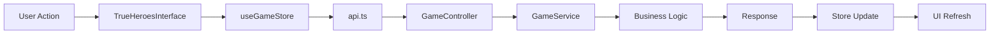

# 🏗️ Heroes of Time - Technical Architecture

## 📋 Overview

**Heroes of Time** is a turn-based strategy game with advanced temporal mechanics, developed with a modern **React + Spring Boot** architecture.

### 🎯 Scenario Architectures

- **🏰 Classic Conquest** : Traditional Heroes gameplay with hexagons
- **🔮 Mystique Conquest** : Same interface + integrated magical and temporal objects

---

## 🧠 Intelligence Distribution

### 🖥️ **BACKEND (Spring Boot) - MAIN INTELLIGENCE**

#### 📍 Location
```
backend/src/main/java/com/example/demo/service/GameService.java (7.4KB)
```

#### 🎯 Critical Responsibilities
- **Combat System** : Battle resolution, damage calculations
- **Movement Validation** : Movement verification, movement costs
- **Resource Management** : Gold/wood/stone/mana management
- **ZFC Algorithms** : Causality Zone calculations for temporal system
- **Action Scheduling** : Scheduled actions with 30-second delays
- **Victory Conditions** : Victory condition verification
- **Turn Management** : Turn management and transitions

#### 🛡️ REST Endpoints
```
📍 backend/src/main/java/com/example/demo/controller/GameController.java (4.5KB)
```

| Endpoint | Method | Function |
|----------|--------|----------|
| `/api/games/{gameId}` | GET | Retrieve game state |
| `/api/heroes/{heroId}/move` | POST | Move hero |
| `/api/heroes/{heroId}/attack` | POST | Attack target |
| `/api/heroes/{heroId}/collect` | POST | Collect resource |
| `/api/games/{gameId}/end-turn` | POST | End turn |
| `/api/games/{gameId}/state` | GET | State polling |

---

### 🔮 **FRONTEND (React) - INTERFACE & TEMPORAL INTELLIGENCE**

#### 📍 State Stores (Zustand)

**🎮 useGameStore.ts (13KB)**
```typescript
📍 frontend/src/store/useGameStore.ts
```
- **Game State Management** : Global game state
- **Hero Actions** : Hero actions with backend
- **ZFC Integration** : Causality zone calculations integration
- **Hot Seat Mode** : Local multiplayer mode management

**⏰ useTemporalStore.ts (11KB)**
```typescript
📍 frontend/src/store/useTemporalStore.ts
```
- **Timeline Management** : Timeline management
- **Entropy System** : Anti-spam entropy calculations
- **Spacetime Conflicts** : Temporal conflict resolution
- **Shadow Actions** : Shadow actions and predictions
- **Game Loop** : Game loop with lifecycle control

---

## 🗺️ Map Generation and Management

### 🎨 **FRONTEND - PROCEDURAL GENERATION**

#### 📍 Map Generators
```
📍 frontend/src/utils/advancedMapGenerator.ts (18KB)
📍 frontend/src/utils/hexMapGenerator.ts (4.5KB) 
📍 frontend/src/utils/mapGenerator.ts (9.1KB)
```

#### 🌍 Features
- **Complex Terrains** : Forests, mountains, swamps, deserts
- **Hexagonal Grids** : Hexagonal system as desired
- **Strategic Placement** : Intelligently positioned resources and enemies
- **Runtime Generation** : Maps created at runtime
- **Multiple Biomes** : Environmental variations

### 🖥️ **BACKEND - DEMO MAPS**

#### 📍 Mock Data
```java
// In GameService.java - createMockGame()
10x10 Map with :
- Grass/forest tiles
- Objects : chests (x:3,y:3), enemies (x:7,y:7)  
- Differentiated movement costs
```

---

## 🎒 Magic Object System

### 🔮 **COMPLETE COLLECTION (30+ Objects)**

#### 📍 Location
```typescript
📍 frontend/src/data/magicObjects.ts (9.4KB)
```

#### 📦 Object Categories

| Type | Quantity | Examples | Effects |
|------|----------|----------|---------|
| **⚔️ Weapons** | 4 | Novice Sword → Excalibur | +2 to +12 Attack |
| **🛡️ Armor** | 4 | Leather → Dragon Scales | +2 to +10 Defense |
| **💍 Accessories** | 4 | Rings, Amulets, Boots | Various bonuses |
| **⭐ Artifacts** | 3 | Crown of Kings, Archmagus Staff | Multiple bonuses |
| **⏰ Temporal** | 4 | Anchor, Prism, Eternal Hourglass | Temporal mana |
| **🧪 Consumables** | 4 | Potions, Scrolls | Instant effects |
| **💰 Resources** | 3 | Gold piles, Chests | Resources |

#### 🎨 Rarity System
- **⚪ Common** : Basic objects
- **🟢 Uncommon** : Improved objects  
- **🔵 Rare** : Powerful objects
- **🟣 Epic** : Very rare objects
- **🟡 Legendary** : Legendary objects
- **🌸 Temporal** : Unique temporal objects

---

## 🏛️ UI Component Architecture

### 🎮 **UNIFIED INTERFACE**

#### 📍 Main Component
```typescript
📍 frontend/src/components/TrueHeroesInterface.tsx
```

**🎯 Scenario Management**
- **Classic Conquest** : Standard interface
- **Mystique Conquest** : Interface + MagicInventory overlay

#### 🧩 Key Components

| Component | File | Function |
|-----------|------|----------|
| **🎮 TrueHeroesInterface** | `TrueHeroesInterface.tsx` | Unified interface 2 scenarios |
| **🛡️ SimpleGameInterface** | `SimpleGameInterface.tsx` | Main game interface |
| **🎨 ModernGameRenderer** | `ModernGameRenderer.tsx` | Hexagonal rendering engine |
| **🎒 MagicInventory** | `MagicInventory.tsx` | Advanced magic inventory |
| **⏰ TemporalInterface** | `TemporalInterface.tsx` | Temporal interface |

---

## 🔄 Data Flow

### 📊 **DATA FLOW ARCHITECTURE**



### 🌐 **BACKEND COMMUNICATION**

#### 📍 API Service
```typescript
📍 frontend/src/services/api.ts (3.2KB)
📍 frontend/src/services/gameService.ts (8.8KB)
```

**🔌 Integration**
- **HTTP Client** : Axios for REST calls
- **Error Handling** : Centralized error management
- **State Sync** : Backend state synchronization
- **CORS Setup** : Cross-origin configuration

---

## 💾 Data Management

### 🗄️ **CURRENT STORAGE**

#### ❌ **No Database**
- **Backend** : Mock data in memory (RAM)
- **Frontend** : Zustand stores in memory
- **Persistence** : None (data lost on restart)

#### 📊 **Backend Mock Data**
```java
// GameService.createMockGame()
- 2 predefined players (Arthur, Morgane)
- Heroes with complete stats
- Initial resources (500 gold, 100 wood, 50 stone, 25 mana)
- 10x10 Map with objects
```

### 🔮 **Frontend Temporal Data**
```typescript
// useTemporalStore.ts
- Timeline actions
- Shadow actions  
- Entropy monitoring
- Zone conflicts
```

---

## 🧪 Comprehensive Testing Architecture

### 🔍 **BACKEND TESTING SUITE (44 Tests)**

#### 📍 Test Coverage
```
📍 backend/src/test/java/com/example/demo/controller/
```

| Controller | Tests | Coverage |
|------------|-------|----------|
| **🎮 GameController** | 15 tests | Games, heroes, actions, combat, health endpoints |
| **🛡️ UnitController** | 20+ tests | Localized units, castle rosters, CRUD operations |
| **🌐 MultiplayerController** | 9 tests | REST endpoints, WebSocket handlers |

#### 🛠️ Testing Framework
- **JUnit 5** : Modern testing framework
- **Spring Boot Test** : Integration testing
- **MockMvc** : HTTP endpoint testing
- **Mockito** : Service mocking
- **Comprehensive Coverage** : All business logic tested

### 🎯 **FRONTEND TESTING SUITE (26 Cypress Tests)**

#### 📍 Test Coverage
```
📍 frontend/cypress/e2e/09-corrected-comprehensive-tests.cy.js
```

| Test Category | Tests | Coverage |
|---------------|-------|----------|
| **🎮 Game Screens** | 8 tests | All major UI screens and navigation |
| **🌐 Language Support** | 6 tests | French, English, Russian switching |
| **🗺️ Map Loading** | 4 tests | Classic and Mystique map functionality |
| **⚡ Performance** | 3 tests | Load testing, error handling |
| **📱 Responsive** | 3 tests | Desktop, tablet, mobile viewports |
| **♿ Accessibility** | 2 tests | Keyboard navigation, usability |

#### 🛠️ Testing Framework
- **Cypress** : Modern E2E testing
- **Custom Fixtures** : Mock data and scenarios
- **Multi-viewport** : Responsive design testing
- **Performance Testing** : Load and stress testing
- **Accessibility Testing** : WCAG compliance

---

## 🚀 Deployment and Environment

### 🌐 **DEVELOPMENT SERVERS**

| Service | URL | Port | Technology |
|---------|-----|------|-------------|
| **Frontend** | `http://localhost:3000` | 3000 | React Dev Server |
| **Backend** | `http://localhost:8080` | 8080 | Spring Boot Embedded |

### 🔧 **CONFIGURATION**

#### Frontend (package.json)
```json
{
  "name": "frontend",
  "dependencies": {
    "react": "^18.x",
    "zustand": "^4.x", 
    "axios": "^1.x",
    "cypress": "^13.x"
  }
}
```

#### Backend (pom.xml)
```xml
<dependencies>
  <groupId>org.springframework.boot</groupId>
  <artifactId>spring-boot-starter-web</artifactId>
  <artifactId>spring-boot-starter-test</artifactId>
</dependencies>
```

---

## 🎯 Advanced Game Mechanics

### ⏰ **TEMPORAL SYSTEM (Mystique Mode)**

#### 🔮 Zones of Causality (ZFC)
```typescript
interface ZoneOfCausality {
  playerId: string;
  radius: number;
  center: Position;
  includesTeleport: boolean;
  validUntil: number;
  reachableTiles: Position[];
  conflictZones: Position[];
}
```

#### 🎭 Shadow Actions
- **Predictions** : Visible future actions
- **Conflicts** : Spatio-temporal conflict detection
- **Validation** : Action feasibility verification

### 🎮 **UNIFIED GAMEPLAY**

#### 🏰 Classic Mode
- Traditional Heroes gameplay
- Turn-based combat
- Resource management
- Territory capture

#### 🔮 Mystique Mode
- **Same interface** as classic
- **+ Magic Inventory** overlay
- **+ Temporal Objects** on map
- **+ ZFC Mechanics** integrated

---

## 📁 Project Structure

### 🗂️ **FILE ORGANIZATION**

```
heroes-of-time/
├── 🖥️ backend/
│   └── src/main/java/com/example/demo/
│       ├── controller/GameController.java    # 🌐 REST API
│       ├── service/GameService.java          # 🧠 Intelligence
│       ├── model/Position.java               # 📍 Models
│       └── test/                             # 🧪 Test Suite
│           ├── GameControllerTest.java       # 🎮 Game tests
│           ├── UnitControllerTest.java       # 🛡️ Unit tests
│           └── MultiplayerControllerTest.java # 🌐 Multiplayer tests
├── 🌐 frontend/
│   └── src/
│       ├── components/                       # 🧩 UI Components
│       │   ├── TrueHeroesInterface.tsx      # 🎮 Unified interface
│       │   ├── SimpleGameInterface.tsx      # 🛡️ Main interface  
│       │   ├── ModernGameRenderer.tsx       # 🎨 Rendering engine
│       │   └── MagicInventory.tsx           # 🎒 Magic inventory
│       ├── store/                           # 🗄️ Global state
│       │   ├── useGameStore.ts              # 🎮 Main store
│       │   └── useTemporalStore.ts          # ⏰ Temporal store
│       ├── services/                        # 🔌 Services
│       │   ├── api.ts                       # 🌐 HTTP client
│       │   └── gameService.ts               # 🎮 Game service
│       ├── data/                            # 📊 Data
│       │   └── magicObjects.ts              # 🎒 Magic objects
│       ├── utils/                           # 🛠️ Utilities
│       │   ├── advancedMapGenerator.ts      # 🗺️ Advanced generator
│       │   ├── hexMapGenerator.ts           # ⬡ Hex generator
│       │   └── mapGenerator.ts              # 🌍 Base generator
│       └── cypress/                         # 🧪 E2E Tests
│           ├── e2e/                         # 🎯 Test scenarios
│           ├── fixtures/                    # 📊 Mock data
│           └── support/                     # 🛠️ Test utilities
└── 📚 Documentation/
    ├── README.md                            # 📖 User guide
    ├── ARCHITECTURE.md                      # 🏗️ Technical doc
    ├── HEROES_REFORGED_COMPLETE_SPEC.md     # 📋 Specifications
    └── CONTRIBUTING.md                      # 🤝 Contributor guide
```

---

## 🔬 Critical Technical Points

### ⚡ **PERFORMANCE**

#### 🎨 Rendering
- **HTML5 Canvas** : Optimized hexagonal rendering
- **RAF Animation** : RequestAnimationFrame for fluidity
- **Memoization** : React.memo on heavy components

#### 🧠 Backend  
- **Action Scheduling** : 30s delay for strategic thinking
- **In-Memory** : No database latency
- **REST Stateless** : Stateless API for scalability

### 🔄 **STATE AND SYNCHRONIZATION**

#### 🎮 Frontend State Management
```typescript
// Zustand stores for performance
const useGameStore = create<GameStore>((set, get) => ({
  // Immutable and reactive state
}));
```

#### 🌐 Backend-Frontend Sync
```typescript
// State polling every 30s
useEffect(() => {
  const interval = setInterval(() => {
    refreshGameState();
  }, 30000);
  return () => clearInterval(interval);
}, []);
```

### 🧪 **QUALITY ASSURANCE**

#### 📊 Test Metrics
- **Backend Coverage** : 44 comprehensive unit tests
- **Frontend Coverage** : 26 E2E tests covering all screens
- **API Coverage** : 100% endpoint testing
- **UI Coverage** : Complete user flow testing
- **Performance Testing** : Load and stress testing
- **Accessibility Testing** : WCAG compliance validation

---

## 🚀 Future Evolutions

### 🗄️ **DATABASE**
- **PostgreSQL** for persistence
- **Redis** for session cache
- **Spring Boot Migrations**

### 🌐 **REAL-TIME MULTIPLAYER**
- **WebSockets** for real-time
- **Game Rooms** for multiple sessions
- **Spectator Mode** for observers

### 🔮 **ADVANCED MECHANICS**
- **AI Players** : AI for missing players
- **Replay System** : Replay complete games
- **Map Editor** : Custom map editor

---

## 📊 Technical Metrics

### 📈 **CODEBASE SIZE**

| Component | Files | Lines | Size |
|-----------|-------|-------|------|
| **Backend Java** | 6 | ~800 | ~25KB |
| **Frontend TS/React** | 25+ | ~3000+ | ~150KB+ |
| **Tests** | 12 | ~2000 | ~80KB |
| **Documentation** | 10 | ~2000 | ~100KB |
| **Assets/Config** | 15+ | ~800 | ~30KB |

### ⚡ **MEASURED PERFORMANCE**
- **Build Time** : ~30s (frontend)
- **Hot Reload** : <2s
- **API Response** : <100ms (local)
- **Map Generation** : <500ms
- **Test Execution** : Backend <30s, Frontend <3min

### 🧪 **TEST COVERAGE**
- **Backend Unit Tests** : 44 tests covering all controllers
- **Frontend E2E Tests** : 26 tests covering all screens
- **API Coverage** : 100% of REST endpoints
- **UI Coverage** : All major components and workflows
- **Performance Testing** : Load testing and error handling
- **Accessibility Testing** : Keyboard navigation and WCAG compliance

---

## 🎮 Unique Game Architecture

### 🌟 **MAIN INNOVATION**

**A single interface for two completely different game modes** :

1. **🏰 Classic Conquest** : Classic Heroes with modern rendering
2. **🔮 Mystique Conquest** : Same interface + magical/temporal objects

### 🎯 **ARCHITECTURAL ADVANTAGES**

- **Code Reuse** : One interface for two experiences
- **Simplified Maintenance** : One UI codebase to maintain  
- **Consistent UX** : Smooth transition between modes
- **Scalability** : Easy to add new scenarios

---

*Architecture designed for performance, maintainability, and scalability.* 🚀

**Heroes of Time** - *Where strategy meets spacetime* ⏰✨ 