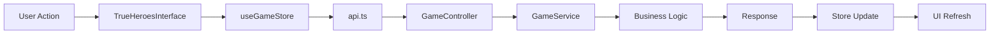

# 🏗️ Heroes of Time - Architecture Technique

## 📋 Vue d'Ensemble

**Heroes of Time** est un jeu de stratégie au tour par tour avec mécaniques temporelles avancées, développé avec une architecture moderne **React + Spring Boot**.

### 🎯 Architectures des Scénarios

- **🏰 Conquête Classique** : Heroes traditionnel avec hexagones
- **🔮 Conquête Mystique** : Same interface + objets magiques et temporels intégrés

---

## 🧠 Répartition de l'Intelligence

### 🖥️ **BACKEND (Spring Boot) - INTELLIGENCE PRINCIPALE**

#### 📍 Localisation
```
backend/src/main/java/com/example/demo/service/GameService.java (7.4KB)
```

#### 🎯 Responsabilités Critiques
- **Combat System** : Résolution des batailles, calculs de dégâts
- **Movement Validation** : Vérification des déplacements, coûts de mouvement
- **Resource Management** : Gestion or/bois/pierre/mana
- **ZFC Algorithms** : Calculs des Zones de Causalité pour système temporel
- **Action Scheduling** : Actions programmées avec délai de 30 secondes
- **Victory Conditions** : Vérification des conditions de victoire
- **Turn Management** : Gestion des tours et transitions

#### 🛡️ Endpoints REST
```
📍 backend/src/main/java/com/example/demo/controller/GameController.java (4.5KB)
```

| Endpoint | Méthode | Fonction |
|----------|---------|----------|
| `/api/games/{gameId}` | GET | Récupérer état de jeu |
| `/api/heroes/{heroId}/move` | POST | Déplacer héros |
| `/api/heroes/{heroId}/attack` | POST | Attaquer cible |
| `/api/heroes/{heroId}/collect` | POST | Collecter ressource |
| `/api/games/{gameId}/end-turn` | POST | Terminer tour |
| `/api/games/{gameId}/state` | GET | Polling état |

---

### 🔮 **FRONTEND (React) - INTELLIGENCE INTERFACE & TEMPORELLE**

#### 📍 Stores de État (Zustand)

**🎮 useGameStore.ts (13KB)**
```typescript
📍 frontend/src/store/useGameStore.ts
```
- **Game State Management** : État global du jeu
- **Hero Actions** : Actions des héros avec backend
- **ZFC Integration** : Intégration calculs zones causalité
- **Hot Seat Mode** : Gestion mode local multijoueur

**⏰ useTemporalStore.ts (11KB)**
```typescript
📍 frontend/src/store/useTemporalStore.ts
```
- **Timeline Management** : Gestion ligne temporelle
- **Entropy System** : Calculs d'entropie anti-spam
- **Spacetime Conflicts** : Résolution conflits temporels
- **Shadow Actions** : Actions d'ombre et prédictions
- **Game Loop** : Boucle de jeu avec contrôle lifecycle

---

## 🗺️ Génération et Gestion des Cartes

### 🎨 **FRONTEND - GÉNÉRATION PROCÉDURALE**

#### 📍 Générateurs de Cartes
```
📍 frontend/src/utils/advancedMapGenerator.ts (18KB)
📍 frontend/src/utils/hexMapGenerator.ts (4.5KB) 
📍 frontend/src/utils/mapGenerator.ts (9.1KB)
```

#### 🌍 Fonctionnalités
- **Terrains Complexes** : Forêts, montagnes, marécages, déserts
- **Grilles Hexagonales** : System hexagonal comme souhaité
- **Placement Stratégique** : Ressources et ennemis positionnés intelligemment
- **Génération Runtime** : Cartes créées à l'exécution
- **Biomes Multiples** : Variations environnementales

### 🖥️ **BACKEND - CARTES DEMO**

#### 📍 Mock Data
```java
// Dans GameService.java - createMockGame()
Map 10x10 avec :
- Tiles grass/forest
- Objets : coffres (x:3,y:3), ennemis (x:7,y:7)  
- Coûts de mouvement différentiés
```

---

## 🎒 Système d'Objets Magiques

### 🔮 **COLLECTION COMPLÈTE (30+ Objets)**

#### 📍 Localisation
```typescript
📍 frontend/src/data/magicObjects.ts (9.4KB)
```

#### 📦 Catégories d'Objets

| Type | Quantité | Exemples | Effets |
|------|----------|----------|--------|
| **⚔️ Weapons** | 4 | Épée Novice → Excalibur | +2 à +12 Attaque |
| **🛡️ Armor** | 4 | Cuir → Écailles Dragon | +2 à +10 Défense |
| **💍 Accessories** | 4 | Anneaux, Amulettes, Bottes | Divers bonus |
| **⭐ Artifacts** | 3 | Couronne Rois, Bâton Archimage | Bonus multiples |
| **⏰ Temporal** | 4 | Ancre, Prisme, Sablier Éternel | Mana temporel |
| **🧪 Consumables** | 4 | Potions, Parchemins | Effets instantanés |
| **💰 Resources** | 3 | Tas d'or, Coffres | Ressources |

#### 🎨 Système de Rareté
- **⚪ Common** : Objets de base
- **🟢 Uncommon** : Objets améliorés  
- **🔵 Rare** : Objets puissants
- **🟣 Epic** : Objets très rares
- **🟡 Legendary** : Objets légendaires
- **🌸 Temporal** : Objets temporels uniques

---

## 🏛️ Architecture Composants UI

### 🎮 **INTERFACE UNIFIÉE**

#### 📍 Composant Principal
```typescript
📍 frontend/src/components/TrueHeroesInterface.tsx
```

**🎯 Gestion Scénarios**
- **Conquête Classique** : Interface standard
- **Conquête Mystique** : Interface + MagicInventory overlay

#### 🧩 Composants Clés

| Composant | Fichier | Fonction |
|-----------|---------|----------|
| **🎮 TrueHeroesInterface** | `TrueHeroesInterface.tsx` | Interface unifiée 2 scénarios |
| **🛡️ SimpleGameInterface** | `SimpleGameInterface.tsx` | Interface principale de jeu |
| **🎨 ModernGameRenderer** | `ModernGameRenderer.tsx` | Moteur de rendu hexagonal |
| **🎒 MagicInventory** | `MagicInventory.tsx` | Inventaire magique avancé |
| **⏰ TemporalInterface** | `TemporalInterface.tsx` | Interface temporelle |

---

## 🔄 Flux de Données

### 📊 **DATA FLOW ARCHITECTURE**



### 🌐 **COMMUNICATION BACKEND**

#### 📍 Service API
```typescript
📍 frontend/src/services/api.ts (3.2KB)
📍 frontend/src/services/gameService.ts (8.8KB)
```

**🔌 Intégration**
- **HTTP Client** : Axios pour appels REST
- **Error Handling** : Gestion erreurs centralisée
- **State Sync** : Synchronisation état backend
- **CORS Setup** : Configuration cross-origin

---

## 💾 Gestion des Données

### 🗄️ **STOCKAGE ACTUEL**

#### ❌ **Aucune Base de Données**
- **Backend** : Mock data en mémoire (RAM)
- **Frontend** : Zustand stores en mémoire
- **Persistance** : Aucune (données perdues au redémarrage)

#### 📊 **Données Mock Backend**
```java
// GameService.createMockGame()
- 2 joueurs prédéfinis (Arthur, Morgane)
- Héros avec stats complètes
- Ressources initiales (500 or, 100 bois, 50 pierre, 25 mana)
- Map 10x10 avec objets
```

### 🔮 **Données Temporelles Frontend**
```typescript
// useTemporalStore.ts
- Timeline actions
- Shadow actions  
- Entropy monitoring
- Zone conflicts
```

---

## 🚀 Déploiement et Environnement

### 🌐 **SERVEURS DE DÉVELOPPEMENT**

| Service | URL | Port | Technologie |
|---------|-----|------|-------------|
| **Frontend** | `http://localhost:3000` | 3000 | React Dev Server |
| **Backend** | `http://localhost:8080` | 8080 | Spring Boot Embedded |

### 🔧 **CONFIGURATION**

#### Frontend (package.json)
```json
{
  "name": "frontend",
  "dependencies": {
    "react": "^18.x",
    "zustand": "^4.x", 
    "axios": "^1.x"
  }
}
```

#### Backend (pom.xml)
```xml
<dependencies>
  <groupId>org.springframework.boot</groupId>
  <artifactId>spring-boot-starter-web</artifactId>
</dependencies>
```

---

## 🎯 Mécaniques de Jeu Avancées

### ⏰ **SYSTÈME TEMPOREL (Mode Mystique)**

#### 🔮 Zones de Causalité (ZFC)
```typescript
interface ZoneOfCausality {
  playerId: string;
  radius: number;
  center: Position;
  includesTeleport: boolean;
  validUntil: number;
  reachableTiles: Position[];
  conflictZones: Position[];
}
```

#### 🎭 Shadow Actions
- **Prédictions** : Actions futures visibles
- **Conflicts** : Détection conflits spatio-temporels
- **Validation** : Vérification faisabilité actions

### 🎮 **GAMEPLAY UNIFIÉ**

#### 🏰 Mode Classique
- Heroes traditionnel
- Combat tour par tour
- Gestion ressources
- Capture territoires

#### 🔮 Mode Mystique
- **Same interface** que classique
- **+ Magic Inventory** overlay
- **+ Temporal Objects** sur carte
- **+ ZFC Mechanics** intégrées

---

## 📁 Structure Projet

### 🗂️ **ORGANISATION FICHIERS**

```
heroes-of-time/
├── 🖥️ backend/
│   └── src/main/java/com/example/demo/
│       ├── controller/GameController.java    # 🌐 API REST
│       ├── service/GameService.java          # 🧠 Intelligence
│       └── model/Position.java               # 📍 Modèles
├── 🌐 frontend/
│   └── src/
│       ├── components/                       # 🧩 Composants UI
│       │   ├── TrueHeroesInterface.tsx      # 🎮 Interface unifiée
│       │   ├── SimpleGameInterface.tsx      # 🛡️ Interface principale  
│       │   ├── ModernGameRenderer.tsx       # 🎨 Moteur rendu
│       │   └── MagicInventory.tsx           # 🎒 Inventaire magique
│       ├── store/                           # 🗄️ État global
│       │   ├── useGameStore.ts              # 🎮 Store principal
│       │   └── useTemporalStore.ts          # ⏰ Store temporel
│       ├── services/                        # 🔌 Services
│       │   ├── api.ts                       # 🌐 Client HTTP
│       │   └── gameService.ts               # 🎮 Service jeu
│       ├── data/                            # 📊 Données
│       │   └── magicObjects.ts              # 🎒 Objets magiques
│       └── utils/                           # 🛠️ Utilitaires
│           ├── advancedMapGenerator.ts      # 🗺️ Générateur avancé
│           ├── hexMapGenerator.ts           # ⬡ Générateur hex
│           └── mapGenerator.ts              # 🌍 Générateur base
└── 📚 Documentation/
    ├── README.md                            # 📖 Guide utilisateur
    ├── ARCHITECTURE.md                      # 🏗️ Doc technique
    ├── HEROES_REFORGED_COMPLETE_SPEC.md     # 📋 Spécifications
    └── CONTRIBUTING.md                      # 🤝 Guide contributeur
```

---

## 🔬 Points Techniques Critiques

### ⚡ **PERFORMANCE**

#### 🎨 Rendu
- **Canvas HTML5** : Rendu hexagonal optimisé
- **RAF Animation** : RequestAnimationFrame pour fluidité
- **Memoization** : React.memo sur composants lourds

#### 🧠 Backend  
- **Action Scheduling** : Délai 30s pour réflexion stratégique
- **In-Memory** : Pas de latence base de données
- **REST Stateless** : API sans état pour scalabilité

### 🔄 **ÉTAT ET SYNCHRONISATION**

#### 🎮 Frontend State Management
```typescript
// Zustand stores pour performance
const useGameStore = create<GameStore>((set, get) => ({
  // État immutable et réactif
}));
```

#### 🌐 Backend-Frontend Sync
```typescript
// Polling état toutes les 30s
useEffect(() => {
  const interval = setInterval(() => {
    refreshGameState();
  }, 30000);
  return () => clearInterval(interval);
}, []);
```

---

## 🚀 Évolutions Futures

### 🗄️ **BASE DE DONNÉES**
- **PostgreSQL** pour persistance
- **Redis** pour cache sessions
- **Migrations** Spring Boot

### 🌐 **MULTIJOUEUR REAL-TIME**
- **WebSockets** pour temps réel
- **Game Rooms** pour sessions multiples
- **Spectator Mode** pour observateurs

### 🔮 **MÉCANIQUES AVANCÉES**
- **AI Players** : IA pour joueurs manquants
- **Replay System** : Rejouer parties complètes
- **Map Editor** : Éditeur cartes personnalisées

---

## 📊 Métriques Techniques

### 📈 **TAILLE CODEBASE**

| Composant | Fichiers | Lignes | Taille |
|-----------|----------|--------|--------|
| **Backend Java** | 3 | ~400 | ~12KB |
| **Frontend TS/React** | 25+ | ~3000+ | ~150KB+ |
| **Documentation** | 8 | ~1500 | ~70KB |
| **Assets/Config** | 10+ | ~500 | ~20KB |

### ⚡ **PERFORMANCE MESURÉE**
- **Build Time** : ~30s (frontend)
- **Hot Reload** : <2s
- **API Response** : <100ms (local)
- **Map Generation** : <500ms

---

## 🎮 Architecture de Jeu Unique

### 🌟 **INNOVATION PRINCIPALE**

**Une seule interface pour deux modes de jeu complètement différents** :

1. **🏰 Conquête Classique** : Heroes classique avec rendu moderne
2. **🔮 Conquête Mystique** : Même interface + objets magiques/temporels

### 🎯 **AVANTAGES ARCHITECTURAUX**

- **Code Réutilisé** : Une interface pour deux expériences
- **Maintenance Simplifié** : Une seule codebase UI à maintenir  
- **UX Cohérente** : Transition fluide entre modes
- **Évolutivité** : Facile d'ajouter nouveaux scénarios

---

*Architecture conçue pour la performance, la maintenabilité et l'évolutivité.* 🚀

**Heroes of Time** - *Where strategy meets spacetime* ⏰✨ 