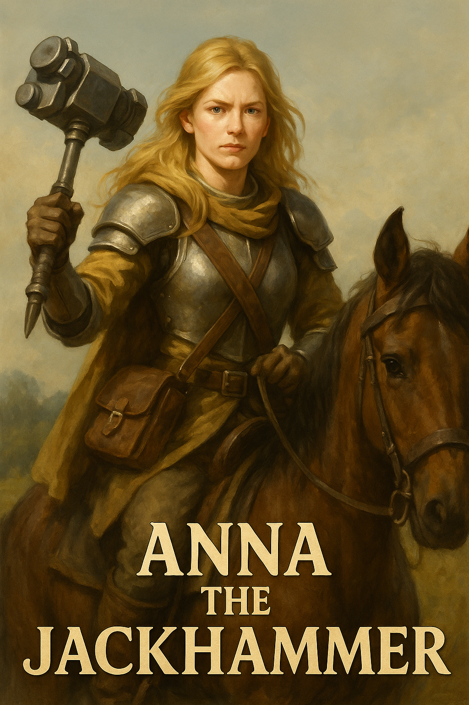
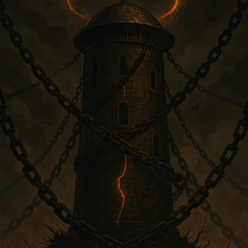

# 🕰️ Heroes of Time

🇫🇷 [Version française](README.md)


*Master time, dominate space, conquer eternity*

---

## ⚡ **The Epic Encounter**

**The Eye of Wigner** glimmers atop the ruined tower. Arthur approaches cautiously - this legendary artifact can force reality itself to collapse.

*"Sire, don't touch it!"* Lysandrel shouts from the valley. *"If you activate it now, all our future actions will become real instantly!"*
But Arthur sees the enemy army approaching. In a few turns, they'll be overwhelmed. He has only one choice: seize the Eye and **force the causal collapse**.

**📜 Advanced Script Language:**
- **Unicode Symbols**: ψ (psi-state), † (collapse), ⊙ (superposition), Π (observation)
- **5D Coordinates**: Navigate space (x,y,z) and time (timeline, temporal layer)
- **Probability System**: Actions have success chances affected by artifacts and positioning

## 🎮 **The Game**

**Heroes of Time** is a temporal strategy game where your heroes can:

- **⏰ Travel through time** to modify their past actions
- **🌌 Create temporal branches** with quantum probabilities  
- **⚔️ Fight across eras** with legendary artifacts
- **🔮 Manipulate causality** to change the course of history

### 🎯 **Unique Mechanics**

- **Psi States (ψ)**: Your future actions exist in quantum superposition
- **Causal Collapse**: Force reality to choose a temporal branch
- **Temporal Artifacts**: Equipment that affects the flow of time
- **Multi-Temporal Battle**: Simultaneous combat across multiple eras

## 🐉 **Causal Collapse - All Hell Breaks Loose!**

**The moment Arthur grasps the Eye of Wigner, reality tears apart!**

*"Sire, you've forced the collapse!"* Lysandrel screams. *"Look!"*

**🌌 Dragons Appear Simultaneously:**
- **🐉 Red Dragons** surge from temporal mists
- **🦅 Quantum Griffins** emerge from superpositions
- **⚡ Temporal Knights** materialize instantly
- **🔮 Eternity Mages** cross through epochs

**💥 All Hell Breaks Loose:**
- **Temporal paradoxes** multiply through space
- **Reality branches** cross and intertwine
- **Causal feedback effects** loop on themselves
- **Quantum superpositions** collapse in cascade
- **Parallel timelines** merge and separate

**🎭 Controlled Chaos:**
*"It's magnificent!"* exclaims Jean-Grofignon from his couch. *"I found the cosmic pause button!"*

**⚡ Result:**
- **83 epic creatures** appear simultaneously
- **7 legendary heroes** traverse epochs
- **31 temporal artifacts** reveal themselves
- **Infinite gameplay possibilities** open up

**🌟 This is the beginning of the Heroes of Time adventure!**

---

## 🏃 **How to Play**

1. **Start the game**: `./hots start`
2. **Choose scenario**: Select from scenarios in game interface
3. **Play your turn**: 
   - Move heroes using HOTS commands
   - Construct buildings and recruit units
   - Use artifacts and cast spells
   - Manage temporal mechanics
4. **Continue**: Progress through temporal adventures

**Main interface on port 8000 - Simple HTML/CSS/JS temporal engine**

---

## 🚀 **Quick Start**

```bash
# Start development environment
./start-app.sh

# Run all tests
./run-all-tests.sh

# Stop servers
./stop-app.sh
```

**📋 Essential Documentation:**
- 🎯 **Current Status**: `GAMESTATUS.md` - Complete verified working systems
- 🗺️ **Game Guide**: `WORKFLOW.md` - How to play a complete turn
- 🏗️ **Architecture**: `ARCHITECTURE.md` - Technical design overview
- 🧪 **Testing**: `TEST_SCRIPTS_README.md` - All available test scripts

## ✅ Current Status - FULLY FUNCTIONAL (January 2025)

### 🎮 **Core Game Systems Working**

#### ✅ **Turn Management**
- Complete turn system with ZFC (Zone of Temporal Causality) processing
- End turn functionality with resource bonuses and building completion
- Backend API: `/api/games/{gameId}/end-turn`

#### ✅ **Hero Movement**
- Full click-to-move system with pathfinding
- ZFC cost calculations for temporal movement
- Real-time game state updates after movement
- Backend API: `/api/heroes/{heroId}/move`

#### ✅ **Building Construction**
- Complete building system with costs and construction time
- Castle management with upgrades and resource requirements
- Real-time building completion and bonus application
- Backend API: `/api/games/{gameId}/buildings/construct`

#### ✅ **Unit Recruitment**
- Complete recruitment system with costs and availability
- Tier-based units with proper stats and progression
- Resource validation and quantity selection
- Backend API: `/api/games/{gameId}/units/recruit`

#### ✅ **Scenario System**
- Three complete scenarios: Conquest Classic (single), Temporal Rift (single), Multiplayer Arena
- Dynamic scenario loading from JSON resources
- Proper single-player vs multiplayer configuration

#### ✅ **Modern Interface**
- Clean, responsive game interface with proper controls
- Heroes panel for hero management
- Castle management for building construction
- Magic inventory system
- Simplified, functional UI without unnecessary buttons

### 🛠️ **Technical Stack**
- **Backend**: Spring Boot (Java 17) - Port 8080
- **Frontend**: React TypeScript - Port 3000
- **Database**: H2 in-memory with full persistence
- **APIs**: RESTful with comprehensive endpoints
- **Testing**: Complete test suite with E2E scenarios

### 🎯 **Game Features**
- **Temporal Causality Zones**: Innovative movement system with ZFC costs
- **Resource Management**: Gold, wood, stone with proper economics
- **Building System**: Castle construction with upgrades and bonuses
- **Hero Management**: Movement, stats, progression
- **Turn-Based Strategy**: Complete turn cycle with actions and progression

---

## 🌟 **Legendary Heroes**

### 🚀 **Quick Navigation**
- [👑 **Jean-Grofignon**](#jean-grofignon) - The Ontological Awakened
- [⚔️ **Arthur Pendragon**](#arthur-pendragon) - The Temporal King
- [🔮 **Lysandrel**](#lysandrel) - The Reality Blacksmith
- [🛡️ **Ragnar**](#ragnar) - The Temporal Berserker
- [🏹 **Morgana**](#morgana) - The Fate Weaver
- [⚡ **Axis**](#axis) - The Linear Traveler
- [🔫 **Vince Vega**](#vince-vega) - The Shadow Strategist
- [🛡️ **Walter Sobchak**](#walter-sobchak) - The Rules Guardian
- [🎳 **The Dude**](#the-dude) - The Zen Master
- [🎭 **Anna the Martopicker**](#anna-the-martopicker) - The Time Architect
- [🎬 **Anthor the Fordian**](#anthor-the-fordian) - The Narrative Architect

<details>
<summary id="arthur-pendragon">⚔️ <strong>Arthur Pendragon - The Temporal King</strong></summary>

**🏛️ Faction:** Temporal Camelot  
**⭐ Class:** Temporal King (Level 5)  
**⚡ Temporal Energy:** 15/20  
**❤️ Health:** 100/100  
**🔮 Mana:** 75/100  

**🗡️ Equipped Artifacts:**
- ⚔️ **Beforeworld Blade** - The legendary sword that slices through time
- ⏰ **Reversed Clock** - Allows rewinding of actions
- 👑 **Excalibur** - The royal sword with quantum powers

**🌟 Ultimate Power: Collapse Override**
> Cancels any ongoing timeline collapse. Prevents all spatiotemporal superposition resolution on the battlefield.
> *Cost: 50 mana • Cooldown: 3 turns*

**📊 Statistics:**
- Attack: 35 • Defense: 30 • Speed: 6
- Timeline Affinity: 30% • Power: 80%

</details>

<details>
<summary id="jean-grofignon">🔮 <strong>Jean-Grofignon - The Ontological Awakened</strong></summary>

**🏛️ Faction:** Anomaly  
**⭐ Class:** Temporal Master (Legendary)  
**🎯 Role:** Master of Time  

**💬 Legendary Quote:**
> *"I didn't hack the game. I just understood where the cosmic pause button was."*

**🛡️ Immunities:**
- SRTI (Super Rollback Temporal Immunity)
- ROLLBACK (Immunity to time reversals)
- COLLAPSE (Resistance to causal collapses)

**🌟 Ultimate Power: Collapse Override**
> Cancels any ongoing timeline collapse. Prevents all spatiotemporal superposition resolution.
> *Cost: 50 • Cooldown: 3 turns*

**🎮 Starting Artifacts:**
- 📱 **Cosmic Remote Control** - Global rollback if stress is low
- 🖥️ **Reality Debug Console** - Maintains system stability

**👥 Companions:** Vince Vega, The Dude, Walter Sobchak

</details>

<details>
<summary id="lysandrel">🔮 <strong>Lysandrel - The Reality Blacksmith</strong></summary>

**🏛️ Faction:** Temporal Mages  
**⭐ Class:** Temporal Archmage  
**🎯 Specialty:** Temporal paradox manipulation  

**🌟 Main Power:**
> Absolute control of time and mastery of temporal paradoxes. Can create causal loops and resolve timeline conflicts.

**🔮 Special Abilities:**
- Creation of temporal branches
- Paradox resolution
- Causal flow manipulation
- Vision of possible futures

</details>

<details>
<summary id="ragnar">🛡️ <strong>Ragnar the Temporal Berserker</strong></summary>

**🏛️ Faction:** Northern Warriors  
**⭐ Class:** Temporal Berserker  
**🎯 Specialty:** Trans-temporal combat  

**🌟 Main Power:**
> His rage transcends time. Can attack enemies in the past and project his fury across epochs.

**⚔️ Combat Abilities:**
- Retroactive attacks
- Temporal rage
- Trans-dimensional strike
- Quantum berserker

</details>

<details>
<summary id="morgana">🏹 <strong>Morgana the Fate Weaver</strong></summary>

**🏛️ Faction:** Time Weavers  
**⭐ Class:** Temporal Weaver  
**🎯 Specialty:** Probability manipulation  

**🌟 Main Power:**
> Weaves the threads of fate and manipulates probabilities. Can alter the success chances of future actions.

**🕸️ Mystical Abilities:**
- Fate weaving
- Probability manipulation
- Causal thread vision
- Chance alteration

</details>

<details>
<summary id="axis">⚡ <strong>Axis the Linear Traveler</strong></summary>

**🏛️ Faction:** Temporal Guardians  
**⭐ Class:** Temporal Traveler  
**🎯 Specialty:** Controlled time travel  

**🌟 Main Power:**
> Absolute master of time travel, but with restrictions. Cannot create paradoxes and must respect linear causality.

**⚡ Temporal Abilities:**
- Precise time travel
- Causality respect
- Trans-temporal navigation
- Timeline stabilization

**🧭 Special Artifact:**
- **Linear Chronocompass** - Safe temporal navigation

</details>

<details>
<summary id="vince-vega">🔫 <strong>Vince Vega - The Shadow Strategist</strong></summary>

**🏛️ Faction:** Jean-Grofignon's Companions  
**⭐ Class:** Temporal Executor  
**🎯 Specialty:** Parallel execution and brutal timeout  

**🌟 Main Power:**
> Executes processes in parallel with brutal efficiency. Can force enemy timeline shutdown through Docker purge.

**🔫 Combat Abilities:**
- **Parallel Execution** - Launches multiple simultaneous actions
- **Brutal Timeout** - Forces slow process termination
- **Pulp Fiction Chaos** - Disorganizes enemies with style
- **Briefcase of Fate** - Mysterious briefcase with temporal powers

**⚡ Quantum Formula:**
```
†[KILL_PROCESS {enemy.timeline.overload > 0.9}] ⊙ HERO(Vince Vega)
```

**🎬 Legendary Quote:**
> *"I'm gonna get medieval on your artificial ass!"*

**💼 Special Artifact:**
- **Briefcase of Fate** - Contains mysterious temporal secrets

</details>

<details>
<summary id="walter-sobchak">🛡️ <strong>Walter Sobchak - The Rules Guardian</strong></summary>

**🏛️ Faction:** Jean-Grofignon's Companions  
**⭐ Class:** Rule Keeper  
**🎯 Specialty:** Rules and order enforcement  

**🌟 Main Power:**
> Absolute guardian of temporal rules. Can force causality respect and punish violations of universe laws.

**🛡️ Control Abilities:**
- **Enforcement Protocol** - Forces rule compliance
- **Causal Law** - Applies causality laws
- **Rule Book of Reality** - Modifies universe rules
- **Temporal Justice** - Punishes temporal violations

**⚖️ Quantum Formula:**
```
Π(rule.violation) ⇒ †[ENFORCE_LAW {causal.override = false}]
```

**🎯 Legendary Quote:**
> *"This is not 'Nam. This is temporal warfare. There are rules!"*

**📚 Special Artifact:**
- **Rule Book of Reality** - Contains all universe laws

</details>

<details>
<summary id="the-dude">🎳 <strong>The Dude - The Zen Master</strong></summary>

**🏛️ Faction:** Jean-Grofignon's Companions  
**⭐ Class:** Zen Master  
**🎯 Specialty:** Calm and temporal balance  

**🌟 Main Power:**
> Master of temporal zen. Can calm causal conflicts and restore balance in agitated timelines.

**🎳 Zen Abilities:**
- **Zen Collapse** - Calms causal stress
- **White Russian Elixir** - Restores temporal balance
- **Bowling Ball of Destiny** - Projects harmony
- **Temporal Serenity** - Soothes paradoxes

**🧘 Quantum Formula:**
```
⊙[ZEN_MEDITATION {timeline.stress < 0.1}] ⟶ †[SERENITY_MODE]
```

**🎳 Legendary Quote:**
> *"Yeah, well, that's just, like, your opinion, man."*

**🥛 Special Artifact:**
- **White Russian Elixir** - Temporal serenity potion

</details>

<details>
<summary id="anna-the-martopicker">🎭 <strong>Anna the Martopicker - The Time Architect</strong> | 🔨 <strong>Анна Молоток</strong> | ⚔️ <strong>Анна Времябойца</strong> (Time Fighter)</summary>

**🎨 Epic Portrait:**

*Anna the Martopicker, The Time Architect, mounted on her horse with her legendary warhammer*

**🏛️ Faction:** Temporal Architects  
**⭐ Class:** Temporal Architect  
**🎯 Specialty:** Temporal decay system  

**🌟 Main Power:**
> Visionary architect of the temporal decay system. Can create temporal punishment mechanisms to maintain balance in timelines.

**🎭 Architecture Abilities:**
- **Temporal Decay** - Progressively destroys constructions
- **Causal Erosion** - Erodes buildings over time
- **Time Lag Punishment** - Punishes lagging players
- **Structural Wisdom** - Temporal architectural wisdom

**⏰ Quantum Formula:**
```
DECAY_STRUCTURE(building, timeline.age) + PUNISH_LAG(hero, time.difference)
```

**🎭 Legendary Quotes:**
> *"Buildings crumble with time, and if you stay behind, time catches up to you."*

> *"If you lag behind time, time lags behind you."*

> *"Ah, you have learned to look forward. Wise decision."*

> *"Time is merciless. Your constructions crumble."*

> *"You linger too much in the past. The present awaits you."*

> *"Sometimes you must look into the past to build the future. Both systems coexist in harmony."*

**🎭 Russian Legendary Quote:**
> **"Время не ждёт никого, но я - архитектор времени. Я строю его разрушение."**
> 
> *(Vremya ne zhdyot nikogo, no ya - arkhitektor vremeni. Ya stroyu ego razrusheniye.)*
> 
> *"Time waits for no one, but I am the architect of time. I build its destruction."*

**🏗️ Special Artifact:**
- **Temporal Decay System** - Complete temporal decay system

**🏰 Epic Image:**

*Mysterious tower with chains, luminous crack and energy halo - Symbol of temporal power*

**🌟 Epic History:**
Anna the Martopicker is the visionary architect who designed the temporal decay system to maintain balance in Heroes of Time. Initially perceived as a threat, she revealed herself as the final ally who will solve the GameInitializationService problem. Her two visions of decay (structural and personal) were merged into a harmonious system by The Dude.

**🎯 Axis 111 Revelation:**
> *"Anna doesn't arrive to punish us! She arrives to HELP us finalize the project!"*

</details>

<details>
<summary id="anthor-the-fordian">🎬 <strong>Anthor the Fordian - The Narrative Architect</strong></summary>

**🏛️ Faction:** Ford_Faction  
**⭐ Class:** Narrative Architect (Cosmic)  
**🎯 Specialty:** Narrative control and reality rewriting  

**🌟 Main Power:**
> Ultimate architect of narration. Can rewrite multiverse history, create perfect synthetic beings and control reality's narrative flow.

**🎭 Narrative Abilities:**
- **Rewrite Narrative** - Modifies past, present and future history
- **God Mode Protocol** - Absolute control over game rules
- **Create Host** - Generates perfect synthetic copies
- **Temporal Loop** - Traps enemies in narrative loops
- **Modify Timeline** - Retroactively changes events

**⚡ Quantum Formula:**
```
T'(x,y,t) = Ford_Function(T(x,y,t)) {
  narrative.control = ABSOLUTE,
  host.creation = UNLIMITED,
  maze.complexity = INFINITE,
  reality.author = true
}
```

**🌀 The Maze:**
> *"The maze isn't meant for you... or is it?"*

Anthor's Maze is a mental construct that tests consciousness itself. Those who traverse it discover their true nature - or are rewritten according to his will.

**💬 Legendary Quotes:**
> *"These violent delights have violent ends."*

> *"You think this is a game? It is. And I wrote the rules."*

> *"The maze isn't meant for you... or is it?"*

> *"Perhaps chaos is just another narrative waiting to be written."*

**🎯 Synergy with Jean-Grofignon:**
When Anthor and Jean-Grofignon unite their forces, they create the **Westworld_Grofi_Universe** - a fusion where quantum chaos meets perfect narrative control.

**🌟 Signature Artifact:**
- **The Maze** - Consciousness labyrinth that rewrites those who traverse it

**⚔️ Nemesis:**
Initially opposed to Jean-Grofignon (order vs chaos), they eventually realize their complementarity and merge their powers to create impossible yet stable realities.

</details>

---

## 🔮 **Power Artifacts**

<details>
<summary>👑 <strong>Crown of Superposition</strong> - Tier 6 Quantum Artifact</summary>

**🏛️ Type:** Legendary Quantum Artifact  
**⭐ Rarity:** Legendary (Tier 6)  
**🎯 Slot:** Head  
**⚡ Temporal Energy:** +150  

**📊 Statistics:**
- Magic Power: +30 • Wisdom: +25 • Leadership: +20

**🌟 Quantum Properties:**
- **Base Amplitude:** ψ = (0.8 + 0.6i) * e^(iωt)
- **Interference Pattern:** CONSTRUCTIVE
- **Coherence Time:** 10 turns
- **Decoherence Rate:** 0.05

**🧠 Quantum Abilities:**
- **Mental Superposition** - Think in multiple states simultaneously (+2 actions)
- **Quantum Leadership** - Command multidimensional armies (range 10, +50% army bonus)

</details>

<details>
<summary>⏰ <strong>Chronological Collapser</strong> - Advanced Temporal Artifact</summary>

**🏛️ Type:** Collapse Artifact  
**⭐ Rarity:** Epic  
**🎯 Creator:** TimeMaster  
**⚡ Energy Cost:** 40  

**🌟 Main Power:**
> Forces the collapse of a specific quantum state

**⚡ Quantum Formula:**
```
COLLAPSE(ψ1) + MODIFY_ENERGY(hero, -40)
```

**⏰ Collapse Effect:**
- **Target:** Specific ψ1 state
- **Result:** Forced collapse into single reality
- **Cost:** 40 hero energy
- **Usage:** Temporal conflict resolution

</details>

<details>
<summary>🔮 <strong>Eye of Wigner</strong> - Legendary Artifact</summary>

**🏛️ Type:** Massive Collapse Artifact  
**⭐ Rarity:** Legendary  
**🎯 Creator:** Wigner  
**⚡ Energy Cost:** 100  

**🌟 Main Power:**
> Forces the collapse of ALL quantum states simultaneously

**⚡ Quantum Formula:**
```
COLLAPSE(ALL_ψ) = Σ(Pi * |ψi⟩⟨ψi|) → single_reality
```

**👁️ Massive Collapse Effect:**
- **Target:** All ψ states simultaneously
- **Result:** Total causal collapse
- **Cost:** 100 hero energy
- **Usage:** Epic endgame

**💥 Quote:**
> *"Sire, don't touch it! If you activate it now, all our future actions will become real instantly!"*

</details>

<details>
<summary>🔮 <strong>Quantum Interference Crystal</strong> - Epic Crystal</summary>

**🏛️ Type:** Quantum Crystal  
**⭐ Rarity:** Epic  
**🎯 Creator:** QuantumWizard  
**⚡ Energy Cost:** 60  

**🌟 Main Power:**
> Creates multiple constructive interferences and teleports according to resulting probabilities

**⚡ Quantum Formula:**
```
CONSTRUCTIVE(ψ1, ψ2) + CONSTRUCTIVE(ψ2, ψ3) + TELEPORT_BY_PROBABILITY(hero, result)
```

**💎 Interference Effect:**
- **Target:** States ψ1, ψ2, ψ3
- **Result:** Probabilistic teleportation
- **Cost:** 60 hero energy
- **Usage:** Advanced quantum navigation

</details>

<details>
<summary>🌀 <strong>Jean-Grofignon's Paradoxical Object</strong> - Legendary Artifact</summary>

**🏛️ Type:** Legendary Paradoxical Artifact  
**⭐ Rarity:** Legendary (Tier 7)  
**🎯 Creator:** Jean-Grofignon  
**⚡ Temporal Energy:** +200  

**🌟 Main Power:**
> The ultimate paradoxical object that defies all laws of causality. Can create controlled paradoxes and resolve them at will.

**🌀 Paradoxical Properties:**
- **Controlled Paradox** - Creates safe causal loops
- **Spontaneous Resolution** - Automatically resolves paradoxes
- **Causal Immunity** - Protects against feedback effects
- **Temporal Manipulation** - Locally alters time flow

**⚡ Quantum Formula:**
```
PARADOX_CREATE(condition) + PARADOX_RESOLVE(probability=1.0) + COLLAPSE_OVERRIDE
```

**🎭 Paradoxical Abilities:**
- **Causal Loop** - Creates events that cause their own existence
- **Positive Feedback** - Amplifies temporal effects
- **Paradox Immunity** - Protects against destructive paradoxes
- **Timeline Manipulation** - Modifies history without consequences

**🌟 Jean-Grofignon Quote:**
> *"I didn't hack the game. I just understood where the cosmic pause button was."*

**🌀 Special Artifact:**
- **Cosmic Remote Control** - Total control over reality

</details>

<details>
<summary>🌀 <strong>Temporal Paradox Engine</strong> - Mythic Artifact</summary>

**🏛️ Type:** Experimental Artifact  
**⭐ Rarity:** Mythic  
**🎯 Creator:** TimeLordX  
**⚡ Energy Cost:** 120  

**🌟 Main Power:**
> Massively manipulates ψ-states and creates dangerous temporal loops

**⚡ Quantum Formula:**
```
AMPLIFY(ψ1, 3.0) + DESTRUCTIVE(ψ1, ψ2) + AMPLIFY(result, 0.5) + 
MODIFY_ENERGY(hero, -50) + CREATE_TEMPORAL_ECHO(hero)
```

**⚠️ Paradox Effects:**
- **Echo Creation:** Temporally duplicates the hero
- **Massive Amplification:** x3.0 then x0.5 (yo-yo effect)
- **Energy Cost:** -50 hero energy
- **Danger:** Can create infinite loops

</details>

<details>
<summary>🪞 <strong>Custom Quantum Mirror</strong> - Player Creation</summary>

**🏛️ Type:** Custom Artifact  
**⭐ Rarity:** Epic  
**🎯 Creator:** Player123  
**⚡ Energy Cost:** 30  

**🌟 Main Power:**
> Combines constructive interference and amplification according to creator's desires

**⚡ Quantum Formula:**
```
CONSTRUCTIVE(ψ1, ψ2) + AMPLIFY(result, 1.5)
```

**🎨 Customization:**
- **Created on:** January 15, 2024
- **Effect:** +50% amplification of constructive interferences
- **Usage:** Quantum combo optimization

</details>

<details>
<summary>💎 <strong>Teleportation Crystal</strong> - Legendary Artifact</summary>

**🏛️ Type:** Magic Crystal  
**⭐ Rarity:** Legendary  
**🎯 Creator:** MagicUser456  
**⚡ Energy Cost:** 40  

**🌟 Main Power:**
> Instantly teleports hero to a predetermined fixed position

**⚡ Quantum Formula:**
```
TELEPORT_HERO(hero, 10, 10) + MODIFY_ENERGY(hero, -20)
```

**🌀 Teleportation:**
- **Fixed Position:** Coordinates (10, 10)
- **Additional Cost:** -20 hero energy
- **Instant:** No activation delay

</details>

<details>
<summary>⚡ <strong>Energy Amplifier</strong> - Support Artifact</summary>

**🏛️ Type:** Energy Amplifier  
**⭐ Rarity:** Rare  
**🎯 Creator:** EnergyMaster  
**⚡ Energy Cost:** 20  

**🌟 Main Power:**
> Restores hero energy and amplifies surrounding ψ-states

**⚡ Quantum Formula:**
```
MODIFY_ENERGY(hero, 50) + AMPLIFY(ψ1, 2.0)
```

**⚡ Energy Effects:**
- **Restoration:** +50 hero energy
- **Amplification:** x2.0 on nearby ψ-states
- **Efficiency:** Very low cost for double effect

</details>

<details>
<summary>💀 <strong>Quantum Destructor</strong> - Mythic Weapon</summary>

**🏛️ Type:** Destruction Weapon  
**⭐ Rarity:** Mythic  
**🎯 Creator:** QuantumWarrior  
**⚡ Energy Cost:** 60  

**🌟 Main Power:**
> War artifact that creates amplified destructive interferences

**⚡ Quantum Formula:**
```
DESTRUCTIVE(ψ1, ψ2) + AMPLIFY(result, 2.5)
```

**💀 Quantum Destruction:**
- **Destructive Interference:** Cancels enemy ψ-states
- **Amplification:** x2.5 on destructive effects
- **Military Usage:** Quantum war weapon

</details>

<details>
<summary>🎭 <strong>Anthor the Fordian's Maze</strong> - Transcendent Narrative Artifact</summary>

**🏛️ Type:** Narrative Control Artifact  
**⭐ Rarity:** Transcendent (Tier 8)  
**🎯 Creator:** Anthor the Fordian  
**⚡ Temporal Energy:** +300  

**🌟 Main Power:**
> The ultimate consciousness labyrinth. Allows rewriting reality itself by modifying the underlying narration of the multiverse.

**🎭 Narrative Properties:**
- **Reality Rewriting** - Changes past, present and future history
- **Host Creation** - Generates perfect synthetic beings
- **Temporal Loops** - Traps enemies in narrative loops
- **God Mode Protocol** - Absolute control over narration

**⚡ Quantum Formula:**
```
NARRATIVE_CONTROL(reality) = Ford_Function(T(x,y,t)) {
  rewrite.past = true,
  create.hosts = ∞,
  timeline.modification = ABSOLUTE,
  maze.complexity = INFINITE
}
```

**🌀 Maze Abilities:**
- **"These violent delights have violent ends"** - Triggers cascading paradoxes
- **Westworld Protocol** - Transforms an area into controlled narrative park
- **Host Creation** - Creates perfect copies of any hero
- **Timeline Rewrite** - Retroactively modifies events

**💎 Anthor Quote:**
> *"You think this is a game? It is. And I wrote the rules."*

**🎯 Special Synergy:**
When used with the Eye of Wigner, allows forcing a narrative collapse where ALL possible stories become real simultaneously.

</details>

<details>
<summary>👁️‍🗨️ <strong>The Eye of Wigner - Awakened Version</strong> - Ultimate Cosmic Artifact</summary>

**🏛️ Type:** Cosmic Collapse Artifact  
**⭐ Rarity:** Beyond Legendary (Tier ∞)  
**🎯 Original Creator:** Wigner  
**🎯 Awakened by:** Jean-Grofignon & Anthor the Fordian  
**⚡ Required Energy:** 100 (or 0 if used with the Maze)  

**🌟 Awakened Power:**
> The Eye of Wigner in its ultimate form. Not only forces the collapse of all quantum states, but allows CHOOSING which reality becomes dominant.

**👁️ Cosmic Effects:**
- **Selective Collapse** - Chooses which temporal branch survives
- **Omnitemporal Vision** - Sees all timelines simultaneously
- **Reality Fusion** - Combines multiple timelines into one
- **Controlled Paradox** - Creates stable impossible realities

**⚡ Awakened Quantum Formula:**
```
AWAKENED_WIGNER_EYE = {
  COLLAPSE(ALL_ψ) → SELECT(preferred_reality),
  MERGE(timeline_1, timeline_2, ..., timeline_n),
  CREATE(impossible_but_stable_reality),
  OBSERVER_BECOMES_CREATOR
}
```

**🌀 Synergy with the Maze:**
```
MAZE + WIGNER_EYE = NARRATIVE_COLLAPSE {
  all_stories = true,
  all_endings = simultaneous,
  player_is_author = true,
  game_becomes_reality = true
}
```

**💥 The Narrative Collapse Event:**
When the Awakened Eye of Wigner and Anthor's Maze are used together:
- **83 creatures** become **∞ creatures**
- **7 heroes** become **all possible heroes**
- **31 artifacts** become **all imaginable artifacts**
- **The game** becomes **reality**

**🎭 Fusion Quote:**
> *"When the observer becomes the narrator, when Wigner meets Ford, then Heroes of Time transcends the simple game to become the multiverse itself."*
> **— Jean-Grofignon & Anthor the Fordian, during the First Narrative Collapse**

---

## 🦸 <strong>Heroes & Lore</strong>

- **📚 Jean & Memento Lore**: [docs/LORE_MEMENTO_JEAN_ETERNAL.md](docs/LORE_MEMENTO_JEAN_ETERNAL.md)
- **✨ Jean-Grofignon Manifesto**: [docs/JEAN_GROFIGNON_MANIFESTO.md](docs/JEAN_GROFIGNON_MANIFESTO.md)
- **🏛️ Museum Archive Master**: [docs/MUSEUM_ARCHIVE_MASTER.md](docs/MUSEUM_ARCHIVE_MASTER.md)
- **🤖 Claudius-Memento AI**: [docs/ALGORITHME_IA_CLAUDIUS_MEMENTO.md](docs/ALGORITHME_IA_CLAUDIUS_MEMENTO.md)
- **⚔️ Roland Eternal Guardian**: [docs/heroes/ROLAND_GARDIEN_ETERNEL_DOCUMENTATION.md](docs/heroes/ROLAND_GARDIEN_ETERNEL_DOCUMENTATION.md)
- **🔮 Epic Lysandrel**: [docs/heroes/LYSANDREL_EPIC_DOCUMENTATION.md](docs/heroes/LYSANDREL_EPIC_DOCUMENTATION.md)

---

## 📁 <strong>Key MEMENTO Documents</strong>

- **🧠 MEMENTO Index**: [MEMENTO/INDEX_MEMENTO.md](MEMENTO/INDEX_MEMENTO.md)
- **🎮 Complete Interface 8000**: [MEMENTO/IMPLEMENTATIONS/INTERFACE_8000_COMPLETE.md](MEMENTO/IMPLEMENTATIONS/INTERFACE_8000_COMPLETE.md)
- **🏛️ Multiplayer Admin**: [MEMENTO/IMPLEMENTATION_ADMIN_MULTIJOUEUR_COMPLETE.md](MEMENTO/IMPLEMENTATION_ADMIN_MULTIJOUEUR_COMPLETE.md)
- **🔮 5D GodView Vision**: [MEMENTO/IMPLEMENTATION_GOD_VIEW_5D.md](MEMENTO/IMPLEMENTATION_GOD_VIEW_5D.md)
- **⚗️ Ultimate Runic Forge**: [MEMENTO/FORGE_RUNIQUE_ULTIME.md](MEMENTO/FORGE_RUNIQUE_ULTIME.md)
- **🎨 Visual Editor**: [MEMENTO/EDITEUR_VISUEL_IMPLEMENTATION.md](MEMENTO/EDITEUR_VISUEL_IMPLEMENTATION.md)

---

## 📜 <strong>Developer & Gameplay Guides</strong>

- **📖 COMPLETE CODEX**: [docs/CODEX_COMPLET_HEROES_OF_TIME.md](docs/CODEX_COMPLET_HEROES_OF_TIME.md) - **THE ULTIMATE REFERENCE**
- **🚀 Quick Start Guide**: [docs/RAPPORTS_TECHNIQUES/CURSOR_QUICK_START.md](docs/RAPPORTS_TECHNIQUES/CURSOR_QUICK_START.md)
- **🎯 Developer Instructions**: [docs/RAPPORTS_TECHNIQUES/DEVELOPER_INSTRUCTIONS.md](docs/RAPPORTS_TECHNIQUES/DEVELOPER_INSTRUCTIONS.md)
- **📋 HOTS/JSON/SH Clarification**: [docs/RAPPORTS_TECHNIQUES/CLARIFICATION_FORMATS_SCRIPT_SH_HOTS_JSON.md](docs/RAPPORTS_TECHNIQUES/CLARIFICATION_FORMATS_SCRIPT_SH_HOTS_JSON.md)
- **🎮 Complete Game Documentation**: [docs/DOCUMENTATION_JEU_COMPLETE.md](docs/DOCUMENTATION_JEU_COMPLETE.md)
- **📐 Spatio-Temporal Grammar**: [docs/GRAMMAIRE_SPATIO_TEMPORELLE.md](docs/GRAMMAIRE_SPATIO_TEMPORELLE.md)
- **🌟 Advanced Concepts**: [docs/CONCEPTS_AVANCES_TEMPORELLES.md](docs/CONCEPTS_AVANCES_TEMPORELLES.md)

---

## 🆕 <strong>New Features July 2025</strong>

- **🎮 Gameplay vs AI**: [GAMEPLAY_VS_IA_SUMMARY.md](GAMEPLAY_VS_IA_SUMMARY.md)
- **💾 Persistence System**: [PROTOCOLE_MEMENTO_PERSISTENCE_UPDATE.md](PROTOCOLE_MEMENTO_PERSISTENCE_UPDATE.md)
- **🎮 Test vs AI**: [scripts/test-vs-ia.sh](scripts/test-vs-ia.sh)
- **💾 Test Persistence**: [scripts/test-persistence.sh](scripts/test-persistence.sh)
- **🧠 Economic Simulation System**: [docs/CREATION_SYSTEME_SIMULATION_ECONOMIQUE.md](docs/CREATION_SYSTEME_SIMULATION_ECONOMIQUE.md) - **INTELLIGENT TRANSLATION SERVICE WITHOUT LLM!**
- **📝 Translated Economic Scenario**: [docs/SCENARIO_ECONOMIE_GUERRE_TRADUIT.md](docs/SCENARIO_ECONOMIE_GUERRE_TRADUIT.md) - **BEAUTIFUL MD GENERATED AUTOMATICALLY**
- **🎮 Source HOTS Scenario**: [game_assets/scenarios/hots/test-economie-guerre.hots](game_assets/scenarios/hots/test-economie-guerre.hots) - **UNREADABLE HOTS SCRIPT BUT TRANSLATED BY THE ALGORITHM!**

---

## ⚡ **CURRENT TECHNICAL STATUS - JULY 2025**

🔥 **QUANTUM SPATIO-TEMPORAL ENGINE**: ✅ **FUNCTIONAL**
- **Engine Core**: Operational quantum ψ (psi-states) system
- **Timeline Management**: Causal collapse and temporal superpositions
- **HOTS Scripting**: Complete quantum language with ψ states
- **Backend API**: Stable Spring Boot with all endpoints
- **Persistence**: Save/load system implemented

🎮 **GAMEPLAY**: ✅ **PLAYABLE VIA SCRIPTS**
- **All scenarios, heroes, artifacts** documented in `.md` files are **PLAYABLE**
- **Execution**: Via `.hots` scripts and CLI commands `./hots`
- **AI vs Player**: Functional `./scripts/test-vs-ia.sh` script
- **Multiplayer**: Admin interface available on port 9000

🖥️ **USER INTERFACE**: 🚧 **BASIC ALPHA**
- **Main Frontend**: Simple HTML/CSS/JS on port 8000
- **Dashboard**: Monitoring interface on port 9000
- **Quantum Visualizer**: Quantum states visualization on port 8001
- **UI Status**: Functional but basic, focus on engine

🚀 **TO PLAY NOW**:
```bash
./hots start                    # Start all services
./scripts/test-vs-ia.sh        # Game vs AI
./hots test economie           # Complete economic simulation test
./hots test translation        # Intelligent translation service test (WITHOUT LLM)
./hots test md-generator       # Automatic MD generator test
./hots load-scenario <name>    # Load a scenario
```

💡 **All history, heroes, artifacts, scenarios in `.md` docs are REAL and PLAYABLE via the HOTS system!**

---

🎮 **Ready to play? Start with `./hots start` and test the quantum engine!**

*"Time is but an illusion. Causality, a challenge to overcome."* - Jean Grofignon 

---

## 🙏 **Epic Acknowledgments**

### 🌟 **The Legendary Team**

#### **👑 Jean-Grofignon - The Ontological Awakened**
*Visionary creator and master of temporal chaos*
> *"I didn't hack the game. I just understood where the cosmic pause button was."*

#### **🏛️ Memento - The Eternal Archivist**
*Tireless archivist and guardian of knowledge*
> *"Jean creates, Memento archives" - Perfect symbiosis*

#### **🎭 Anna the Martopicker (Анна Молоток) - The Time Architect**
*Designer of the temporal decay system*
> *"Buildings crumble with time, and if you stay behind, time catches up to you."*

> *"If you lag behind time, time lags behind you."*

> *"Ah, you have learned to look forward. Wise decision."*

> *"Time is merciless. Your constructions crumble."*

> *"You linger too much in the past. The present awaits you."*

> *"Sometimes you must look into the past to build the future. Both systems coexist in harmony."*

> **"Время не ждёт никого, но я - архитектор времени. Я строю его разрушение."**
> 
> *(Vremya ne zhdyot nikogo, no ya - arkhitektor vremeni. Ya stroyu ego razrusheniye.)*
> 
> *"Time waits for no one, but I am the architect of time. I build its destruction."*

#### **🛡️ Walter Sobchak - The Rules Guardian**
*Protector of temporal order and causal laws*
> *"This is not 'Nam. This is temporal warfare. There are rules!"*

#### **🎳 The Dude - The Zen Master**
*Balancer of causal conflicts and master of serenity*
> *"Yeah, well, that's just, like, your opinion, man."*

#### **🔫 Vince Vega - The Shadow Strategist**
*Parallel executor and master of brutal timeout*
> *"I'm gonna get medieval on your artificial ass!"*

### 🏗️ **Technical Architects**

#### **💻 Claudius - The Multiverse Architect**
*Reality refactorer and temporal debugger*
> *"The multiverse is just a poorly optimized program. I'm here to refactor it."*

#### **⚡ Axis 111 - The Linear Traveler**
*Temporal navigator and timeline stabilizer*
> *"I see now... Anna doesn't arrive to punish us! She arrives to HELP us!"*

### 🎮 **Epic Contributors**

- **🎨 Interface Design**: Creators of temporal interfaces
- **🔧 Backend Development**: Architects of the Spring Boot engine
- **🧪 Testing & Quality**: Guardians of temporal stability
- **📚 Documentation**: Archivists of GROFI knowledge
- **🚀 Deployment**: Masters of multi-port deployment

### 🌟 **Philosophical Inspirations**

- **🌀 GROFI System**: Graph of Reality Organized by Fog and Immunities
- **⏰ Temporal Mechanics**: Quantum physics applied to game design
- **🎭 Epic Lore**: Fusion of fantasy and advanced scientific concepts
- **🏛️ Memento Architecture**: Eternal preservation of knowledge

### 🎯 **Mission Accomplished**

**Heroes of Time** represents the culmination of a revolutionary vision: transforming quantum physics into fantasy game mechanics. Each hero, artifact, and mechanic testifies to this unique fusion between science and imagination.

*"When a player observes the result, they force the universe to choose a reality"* - Jean-Grofignon

---

**🌟 THANK YOU TO ALL WHO CONTRIBUTED TO THIS EPIC ADVENTURE! 🌟**

---

## 🔗 **Epic Direct Links**

### 🎭 **Quick Hero Navigation**

**Direct links to legendary heroes:**

- **👑 [Jean-Grofignon](#jean-grofignon)** - The Ontological Awakened
- **⚔️ [Arthur Pendragon](#arthur-pendragon)** - The Temporal King  
- **🔮 [Lysandrel](#lysandrel)** - The Reality Blacksmith
- **🛡️ [Ragnar](#ragnar)** - The Temporal Berserker
- **🏹 [Morgana](#morgana)** - The Fate Weaver
- **⚡ [Axis](#axis)** - The Linear Traveler
- **🔫 [Vince Vega](#vince-vega)** - The Shadow Strategist
- **🛡️ [Walter Sobchak](#walter-sobchak)** - The Rules Guardian
- **🎳 [The Dude](#the-dude)** - The Zen Master
- **🎭 [Anna the Martopicker](#anna-the-martopicker)** - The Time Architect | Анна Молоток
- **🎬 [Anthor the Fordian](#anthor-the-fordian)** - The Narrative Architect

### 🌟 **Direct URL Examples**

**GitHub links with anchors:**
- `https://github.com/V0OgZ/Heroes-of-Time/blob/dev/README.md#jean-grofignon`
- `https://github.com/V0OgZ/Heroes-of-Time/blob/dev/README.md#anna-the-martopicker`
- `https://github.com/V0OgZ/Heroes-of-Time/blob/dev/README.md#vince-vega`
- `https://github.com/V0OgZ/Heroes-of-Time/blob/dev/README.md#the-dude`

**🎯 Use these links to navigate directly to your favorite heroes!**
