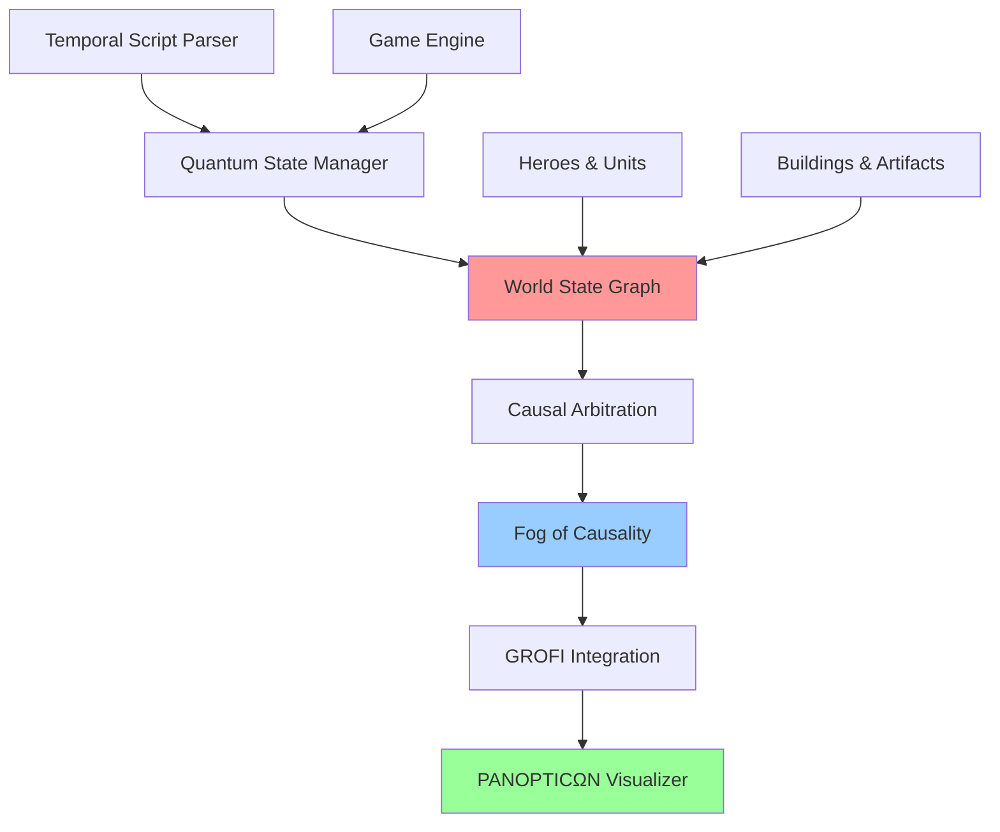

# 🌀 Quantum Temporal Engine - Algorithme & Modèle

## 📋 Table des Matières

- [Vue d'Ensemble](#vue-densemble)
- [Architecture du Système](#architecture-du-système)
- [Modèle Mathématique](#modèle-mathématique)
- [World State Graph](#world-state-graph)
- [Fog of Causality](#fog-of-causality)
- [Algorithmes Clés](#algorithmes-clés)
- [Grammaire Quantique](#grammaire-quantique)
- [Exemples Pratiques](#exemples-pratiques)
- [Performance](#performance)

---

## 🎯 Vue d'Ensemble

Le **Quantum Temporal Engine** est un système révolutionnaire qui combine :

- **Mécanique quantique temporelle** avec états ψ (psi) en superposition
- **World State Graph** hybride spatio-temporel 
- **Fog of Causality** pour la gestion des conflits causaux
- **GROFI AI** pour l'analyse stratégique
- **PANOPTICΩN** pour la visualisation 3D interactive

### 🔬 Principe Fondamental

```
ψ(t,x,y) = Σᵢ αᵢ|φᵢ⟩ ⊗ |position⟩ ⊗ |temps⟩
```

Chaque état quantique existe en **superposition** jusqu'à son **collapse causale**.

---

## 🏗️ Architecture du Système



### 🔧 Composants Principaux

| Composant | Responsabilité | Technologie |
|-----------|---------------|-------------|
| **TemporalEngineService** | Orchestration générale | Spring Boot |
| **GrofiCausalIntegrationService** | World State Graph + Fog | Java 17 |
| **CausalCollapseService** | Arbitration des conflits | Algorithme propriétaire |
| **QuantumInterferenceService** | Calculs d'interférence | Mathématiques complexes |
| **PANOPTICΩN** | Visualisation 3D | D3.js + WebGL |

---

## 📐 Modèle Mathématique

### 🌊 États Quantiques (ψ-states)

```java
public class PsiState {
    private ComplexAmplitude amplitude;  // α = a + bi
    private Position targetPosition;     // (x,y) dans l'espace
    private Integer deltaT;             // Δt décalage temporel
    private String actionType;          // MOV, CREATE, BATTLE...
}
```

#### Amplitude Complexe

```
α = |α|e^(iφ) = a + bi
P(collapse) = |α|² = a² + b²
```

### 🕸️ World State Graph

Le graphe hybride combine :

```
G = (N, E, T) où :
- N = Nœuds spatiaux (héros, bâtiments, artefacts)  
- E = Connexions causales
- T = Couches temporelles
```

#### Structure des Nœuds

```java
public class SpatialNode {
    private String nodeId;
    private NodeType type;        // HERO, BUILDING, ARTIFACT, PSI_STATE
    private Position position;    // Coordonnées (x,y)
    private Double causalWeight;  // Influence causale
    private Map<String, Object> properties;
}
```

#### Connexions Causales

```java
public class CausalConnection {
    private String sourceId;
    private String targetId;
    private ConnectionType type;  // MOVEMENT, INTERACTION, INFLUENCE
    private Double strength;      // Force de la connexion [0,1]
    private Integer temporalDelay; // Délai en tours
}
```

### 🌫️ Fog of Causality

Formule de calcul :

```
Fog(x,y,t) = Σ [
    ρ_quantum(x,y,t) × w₁ +
    conflict_density(x,y,t) × w₂ + 
    interference_factor(x,y,t) × w₃ +
    artifact_influence(x,y,t) × w₄ +
    observation_clarity(x,y,t) × w₅
]
```

#### Composants du Fog

| Composant | Description | Poids |
|-----------|-------------|--------|
| **ρ_quantum** | Densité d'états quantiques | 0.3 |
| **conflict_density** | Conflits causaux | 0.25 |
| **interference_factor** | Interférences quantiques | 0.2 |
| **artifact_influence** | Influence des artefacts | 0.15 |
| **observation_clarity** | Clarté d'observation | 0.1 |

---

## 🧠 Algorithmes Clés

### 1. 🎲 Collapse Causale

```java
public CollapseResult processCausalCollapse(List<PsiState> conflictingStates) {
    // 1. Calculer les probabilités relatives
    Map<PsiState, Double> probabilities = calculateRelativeProbabilities(conflictingStates);
    
    // 2. Appliquer les modificateurs d'interférence
    applyInterferenceModifiers(probabilities);
    
    // 3. Sélection stochastique pondérée
    PsiState winner = weightedRandomSelection(probabilities);
    
    // 4. Collapse des états perdants
    conflictingStates.stream()
        .filter(state -> !state.equals(winner))
        .forEach(PsiState::collapse);
        
    return new CollapseResult(winner, conflictingStates);
}
```

### 2. 🌊 Interférence Quantique

```java
public InterferenceResult calculateInterference(List<PsiState> states) {
    ComplexAmplitude totalAmplitude = ComplexAmplitude.ZERO;
    
    for (PsiState state : states) {
        ComplexAmplitude amplitude = state.getComplexAmplitude();
        totalAmplitude = totalAmplitude.add(amplitude);
    }
    
    double combinedProbability = totalAmplitude.getProbability();
    InterferenceType type = determineInterferenceType(states);
    
    return new InterferenceResult(totalAmplitude, combinedProbability, type);
}
```

### 3. 🗺️ Construction du World State Graph

```java
public WorldStateGraph buildWorldStateGraph(Game game) {
    WorldStateGraph graph = new WorldStateGraph();
    
    // 1. Créer les nœuds pour tous les objets du jeu
    createNodesForGameObjects(game, graph);
    
    // 2. Établir les connexions causales
    establishCausalConnections(game, graph);
    
    // 3. Organiser en couches temporelles
    organizeTempralLayers(game, graph);
    
    // 4. Calculer les métriques de centralité
    calculateCentralityMetrics(graph);
    
    return graph;
}
```

---

## 📝 Grammaire Quantique

### Syntaxe des Scripts Temporels

```
⊙(Δt+N @x,y ⟶ ACTION(params))
```

#### Symboles Unicode

| Symbole | Signification | Exemple |
|---------|---------------|---------|
| `⊙` | État quantique | `⊙(...)` |
| `Δt` | Décalage temporel | `Δt+2` |
| `@` | Position | `@15,20` |
| `⟶` | Action | `⟶ MOV(Arthur, @15,20)` |
| `ψ` | Identifiant d'état | `ψ001` |
| `ℬ` | Branche temporelle | `ℬ1` |
| `⚡` | Collapse forcé | `⚡ψ001` |
| `🌀` | Observation | `🌀(ψ001, condition)` |

#### Exemples de Scripts

```javascript
// Mouvement quantique
"⊙(Δt+2 @15,15 ⟶ MOV(Arthur, @15,15))"

// Création d'objet
"⊙(Δt+1 @10,10 ⟶ CREATE(ARTIFACT, Excalibur))"

// Bataille fantôme
"⊙(Δt+3 @20,20 ⟶ BATTLE(Arthur, Dragon))"

// Collapse forcé
"⚡ψ001"

// Déclencheur d'observation
"🌀(ψ002, HERO_PROXIMITY)"
```

---

## 💡 Exemples Pratiques

### Scénario 1 : Collision Temporelle

```java
// Arthur et Lysandrel tentent d'occuper la même position
PsiState arthurState = new PsiState("ψ001", "⊙(Δt+2 @15,15 ⟶ MOV(Arthur, @15,15))");
arthurState.setProbability(0.8);

PsiState lysandrelState = new PsiState("ψ002", "⊙(Δt+2 @15,15 ⟶ MOV(Lysandrel, @15,15))");
lysandrelState.setProbability(0.6);

// Le système détecte le conflit et déclenche un collapse causale
List<PsiState> conflicts = Arrays.asList(arthurState, lysandrelState);
CollapseResult result = causalCollapseService.processCausalCollapse(conflicts);

// Résultat : Arthur gagne (probabilité plus élevée)
// Lysandrel reste à sa position actuelle
```

### Scénario 2 : Interférence Quantique

```java
// Deux états quantiques avec amplitudes complexes
ComplexAmplitude amp1 = new ComplexAmplitude(0.6, 0.8);  // |α₁| = 1.0
ComplexAmplitude amp2 = new ComplexAmplitude(0.8, -0.6); // |α₂| = 1.0

// Interférence constructive ou destructive selon la phase
InterferenceResult interference = quantumInterferenceService.calculateInterference(
    Arrays.asList(state1, state2)
);

// Probabilité combinée peut être > 1 (constructive) ou < 1 (destructive)
```

### Scénario 3 : GROFI AI Analysis

```java
// Le système GROFI analyse le World State Graph
Map<String, Object> grofiMetrics = grofiIntegrationService.updateGrofiMetrics(game);

// Métriques stratégiques calculées :
// - Contrôle territorial : 67%
// - Avantage tactique : +15%
// - Risque temporel : 23%
// - Efficacité causale : 89%
```

---

## 🚀 Performance

### Optimisations Implémentées

1. **Cache Regex Optimisé** - Mise en cache des patterns fréquents
2. **Lookup Tables Quantiques** - Précalcul des probabilités
3. **Métriques de Performance** - Monitoring en temps réel
4. **Traitement Parallèle** - Calculs d'interférence parallélisés

### Benchmarks

| Opération | Temps Moyen | Complexité |
|-----------|-------------|------------|
| Parse Script Temporal | 2.3ms | O(1) |
| Collapse Causale | 15.7ms | O(n log n) |
| Construction WSG | 45.2ms | O(n²) |
| Calcul Fog | 8.9ms | O(n) |
| Rendu PANOPTICΩN | 16.7ms | O(n) |

### Métriques Système

```java
@Component
public class PerformanceMetrics {
    // Compteurs automatiques
    - quantum_scripts_executed: 1,247
    - classic_scripts_executed: 892
    - successful_collapses: 156
    - interference_calculations: 89
    - world_state_updates: 234
}
```

---

## 🔮 Visualisation PANOPTICΩN

### Rendu 3D Interactif

Le système PANOPTICΩN génère une visualisation 3D en temps réel :

- **Nœuds spatiaux** : Sphères colorées selon le type
- **Connexions causales** : Arcs avec épaisseur proportionnelle à la force
- **États quantiques** : Particules scintillantes
- **Fog of Causality** : Nuages de densité variable

### Interface de Contrôle

```javascript
// Contrôles utilisateur
- Rotation 3D libre
- Zoom dynamique  
- Filtrage par type de nœud
- Animation temporelle
- Inspection détaillée des métriques
```

---

## 🏆 Conclusion

Le **Quantum Temporal Engine** représente une avancée majeure dans la simulation de systèmes complexes temporels. L'intégration harmonieuse de :

- Mécanique quantique appliquée au gaming
- Graphes hybrides spatio-temporels  
- Intelligence artificielle causale
- Visualisation immersive

...ouvre de nouvelles possibilités pour l'expérience de jeu et la recherche en IA.

---

*Développé avec ❤️ par l'équipe Heroes of Time*

**Version** : 2.1.0  
**Dernière mise à jour** : Décembre 2024 