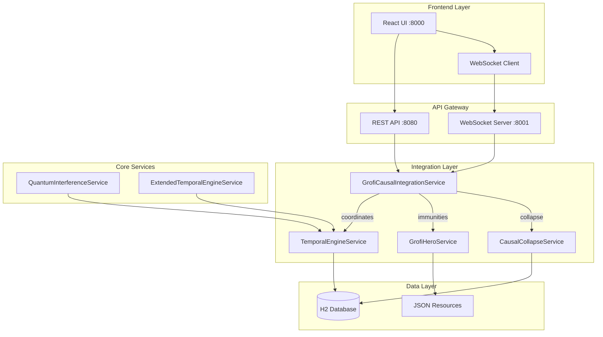
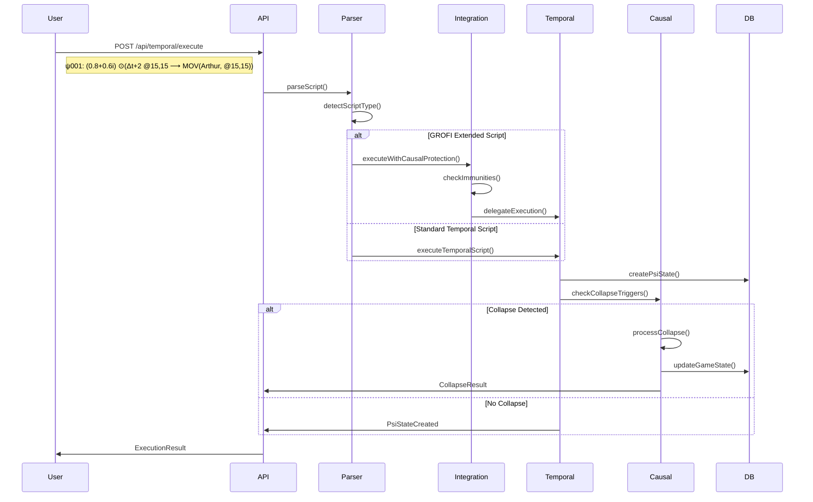
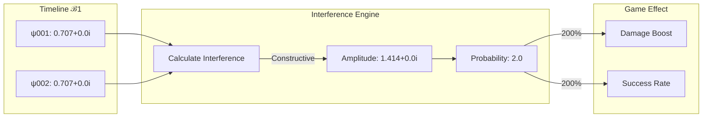
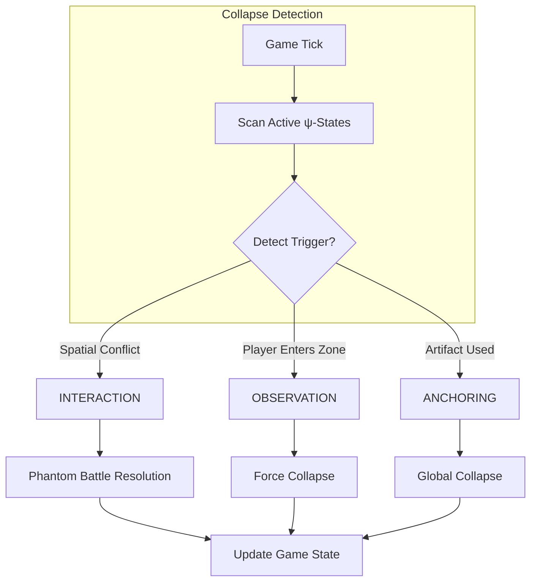
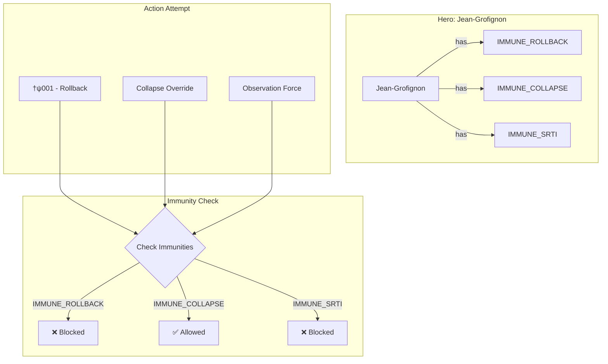
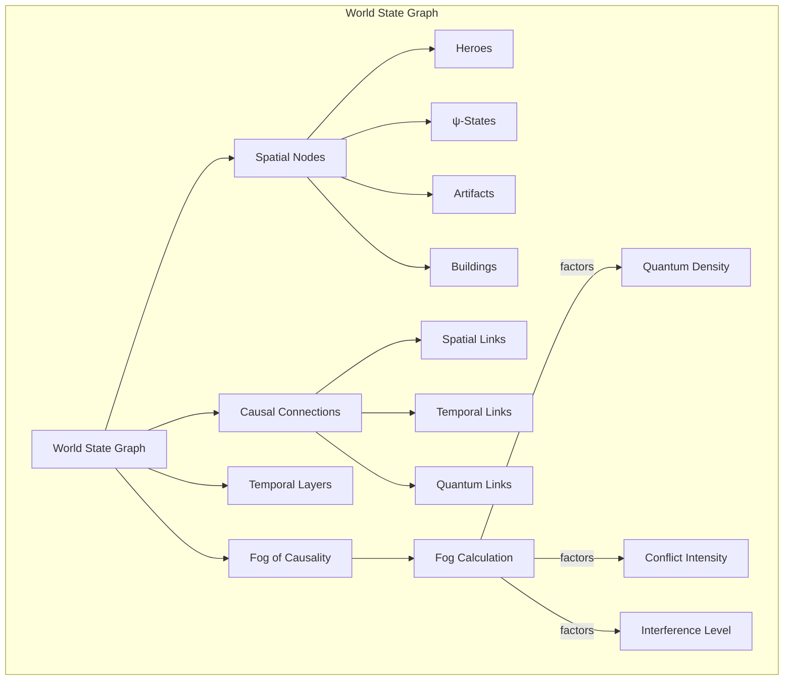
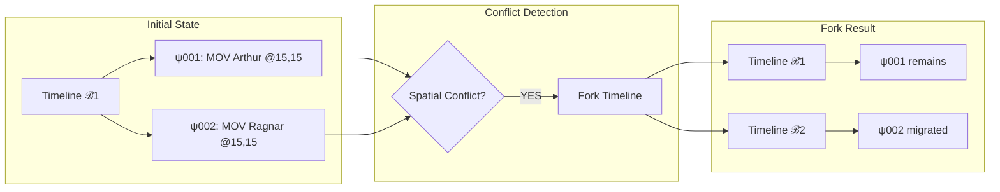
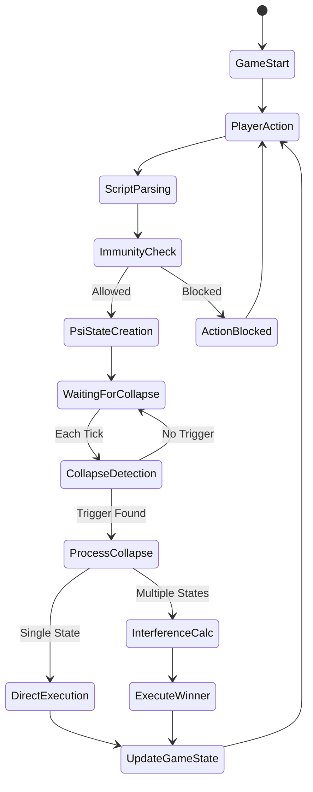
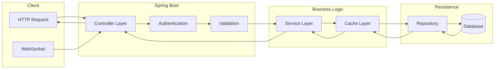
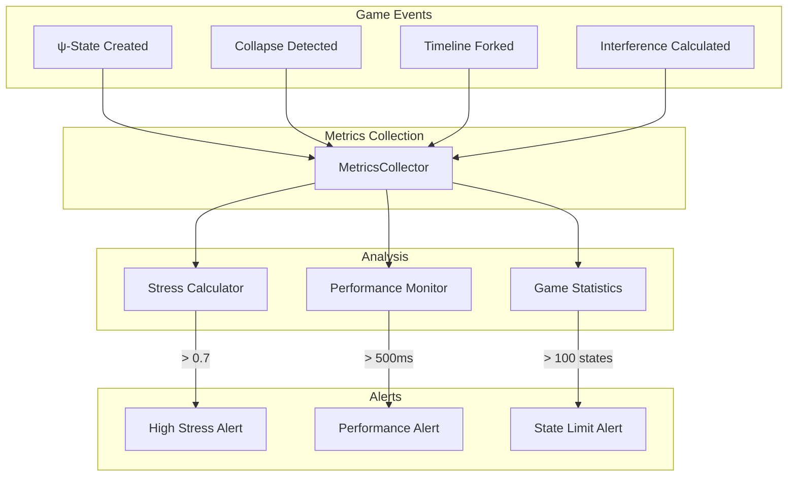

# 🎨 HEROES OF TIME - DIAGRAMMES D'ARCHITECTURE

## 🌐 Architecture Globale



## 🔄 Flux d'Exécution d'un Script Temporel



## 🌀 États Quantiques et Interférences



## 🌊 Types de Collapse Causale



## 🦸 Système d'Immunités GROFI



## 📊 World State Graph Structure



## 🔄 Timeline Fork Mechanism



## 🎮 Complete Game Flow



## 🌟 Quantum Amplitude Lifecycle

```mermaid
graph TD
    subgraph "Creation"
        INPUT[User Input: 0.8+0.6i]
        INPUT --> PARSE[Parse Complex Number]
        PARSE --> CREATE[Create ComplexAmplitude]
    end
    
    subgraph "Evolution"
        CREATE --> EVOLVE[Time Evolution]
        EVOLVE --> |e^(-iEt/ℏ)| PHASE[Phase Rotation]
    end
    
    subgraph "Interference"
        PHASE --> INTER{Other States?}
        INTER -->|Yes| CALC[Calculate Interference]
        INTER -->|No| SINGLE[Single State]
        CALC --> RESULT[Combined Amplitude]
    end
    
    subgraph "Collapse"
        RESULT --> COLLAPSE[Collapse to Reality]
        SINGLE --> COLLAPSE
        COLLAPSE --> PROB[|ψ|² → Action Probability]
        PROB --> EXECUTE[Execute in Game]
    end
```

## 📡 API Request Flow



## 🔍 Monitoring & Metrics Flow



---

Ces diagrammes illustrent les principaux flux et composants du système Heroes of Time, facilitant la compréhension de l'architecture complexe et des interactions entre les différents modules.